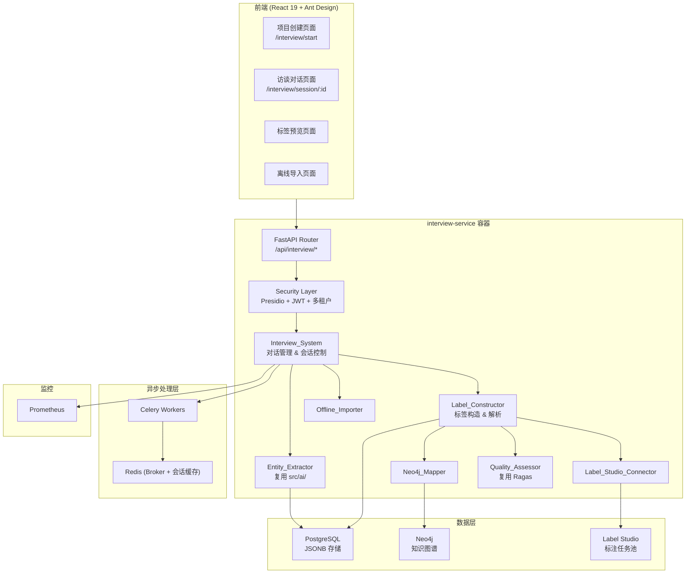
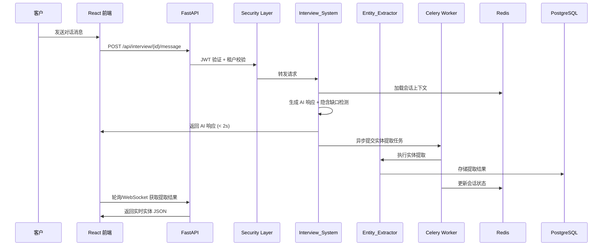
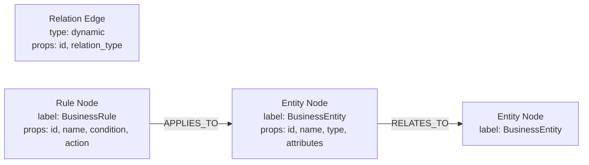

# 设计文档：客户智能访谈与 AI 友好型数据标签模块

## 概述

`client-interview` 模块是 SuperInsight v2.3.0 平台的新增功能模块，提供在线智能访谈能力，通过 AI 驱动的多轮对话收集客户业务需求，实时提取实体/规则/关系，生成标准化 AI 友好型数据标签（AI_Friendly_Label），并与现有标注任务池（Label Studio）、知识图谱（Neo4j）和质量评估体系（Ragas）深度集成。

### 设计目标

- 100% 复用现有技术栈：FastAPI + React 19 + Ant Design + PostgreSQL (JSONB) + Redis/Celery + Neo4j + Label Studio
- 以新增 `interview-service` Docker 容器方式部署，不影响现有服务
- 每轮对话响应 < 2s，耗时操作通过 Celery 异步处理
- 使用 Presidio 进行数据脱敏，基于 JWT + 多租户实现数据隔离
- 支持金融、电商、制造三大行业模板，可扩展

### 关键设计决策

| 决策 | 选择 | 理由 |
|------|------|------|
| 后端框架 | FastAPI | 复用现有技术栈，异步支持好 |
| 对话状态管理 | Redis + PostgreSQL | Redis 缓存活跃会话，PostgreSQL 持久化 |
| 实体提取 | 复用 `src/ai/` 模块 | 避免重复建设，保持一致性 |
| 异步任务 | Celery + Redis | 复用现有队列，处理耗时的 AI 推理 |
| 文件解析 | python-docx / openpyxl / PyPDF2 | 成熟的 Python 文件解析库 |
| 数据脱敏 | Presidio | 需求指定，微软开源方案 |
| 前端组件库 | Ant Design | 复用现有 UI 体系 |

## 架构

### 系统架构图



### 请求处理流程




## 组件与接口

### 1. Interview_System（访谈系统核心）

职责：对话管理、会话生命周期控制、隐含缺口检测、补全建议生成

```python
# src/interview/system.py

class InterviewSystem:
    """访谈系统核心，管理对话流程和会话生命周期"""

    async def create_project(self, tenant_id: str, data: ProjectCreateRequest) -> Project:
        """创建项目，存储至 PostgreSQL JSONB"""

    async def start_session(self, project_id: str, tenant_id: str) -> InterviewSession:
        """启动访谈会话，加载行业模板，初始化 Redis 会话缓存"""

    async def send_message(self, session_id: str, tenant_id: str, message: str) -> AIResponse:
        """处理客户消息，生成 AI 响应，触发异步实体提取"""

    async def detect_implicit_gaps(self, session_id: str) -> list[ImplicitGap]:
        """分析对话上下文，检测隐含信息缺口"""

    async def generate_completions(self, session_id: str) -> list[CompletionSuggestion]:
        """基于上下文生成 5 条补全建议"""

    async def end_session(self, session_id: str, tenant_id: str) -> InterviewSummary:
        """结束会话，生成访谈摘要和实体-规则-属性列表"""

    async def get_session_status(self, session_id: str) -> SessionStatus:
        """获取会话状态，包含当前轮次和异步任务进度"""
```

### 2. Entity_Extractor（实体提取器）

职责：复用 `src/ai/` 模块，对对话内容和文档进行实体/属性/关系提取

```python
# src/interview/entity_extractor.py

class InterviewEntityExtractor:
    """封装现有 src/ai/ 实体提取能力，适配访谈场景"""

    def __init__(self, ai_extractor):
        """注入现有 src/ai/ 模块的提取器实例"""

    async def extract_from_message(self, message: str, context: list[dict]) -> ExtractionResult:
        """从单轮对话消息中提取实体（Celery 异步任务）"""

    async def extract_from_document(self, file_path: str, file_type: str) -> ExtractionResult:
        """从上传文档中提取实体"""

    async def merge_extractions(self, results: list[ExtractionResult]) -> ExtractionResult:
        """合并多次提取结果，去重和冲突解决"""
```

### 3. Label_Constructor（标签构造器）

职责：将访谈结果转换为标准化 AI_Friendly_Label JSON，支持解析和格式化的往返一致性

```python
# src/interview/label_constructor.py

class LabelConstructor:
    """构造、解析和验证 AI 友好型数据标签"""

    def generate_labels(self, project_id: str, extraction_results: list[ExtractionResult]) -> AIFriendlyLabel:
        """将提取结果转换为标准化 AI_Friendly_Label"""

    def parse(self, json_str: str) -> AIFriendlyLabel:
        """将 JSON 字符串解析为内部数据对象，校验结构合法性"""

    def format(self, label: AIFriendlyLabel) -> str:
        """将内部数据对象格式化为标准 JSON 字符串"""

    def validate(self, label: AIFriendlyLabel) -> ValidationResult:
        """校验标签结构是否符合规范"""

    async def store(self, project_id: str, label: AIFriendlyLabel) -> None:
        """同时存储至 PostgreSQL (完整 JSON) 和 Neo4j (实体关系)"""
```

### 4. Label_Studio_Connector（Label Studio 连接器）

职责：将标签数据同步至 Label Studio 任务池，复用 PAT + JWT 认证

```python
# src/interview/label_studio_connector.py

class LabelStudioConnector:
    """复用现有 src/label_studio/ 连接机制，同步访谈标签至任务池"""

    def __init__(self, ls_client):
        """注入现有 Label Studio 客户端（PAT 认证 + JWT 自动刷新）"""

    async def sync_labels(self, project_id: str, label: AIFriendlyLabel) -> SyncResult:
        """将标签同步至 Label Studio，包含 AI 预标注"""

    async def check_connection(self) -> bool:
        """检查 Label Studio 连接状态"""
```

### 5. Neo4j_Mapper（Neo4j 映射器）

职责：将实体和关系映射至 Neo4j 知识图谱

```python
# src/interview/neo4j_mapper.py

class Neo4jMapper:
    """将访谈提取的实体关系映射至 Neo4j 知识图谱"""

    async def map_entities(self, label: AIFriendlyLabel) -> None:
        """将实体节点写入 Neo4j"""

    async def map_relations(self, label: AIFriendlyLabel) -> None:
        """将关系边写入 Neo4j"""

    async def map_label(self, label: AIFriendlyLabel) -> MappingResult:
        """完整映射：实体 + 关系"""
```

### 6. Quality_Assessor（质量评估器）

职责：复用 Ragas 框架评估标签质量

```python
# src/interview/quality_assessor.py

class QualityAssessor:
    """复用现有 quality_monitoring/ 模块的 Ragas 框架"""

    def __init__(self, ragas_evaluator):
        """注入现有 Ragas 评估器"""

    async def assess(self, label: AIFriendlyLabel, context: dict) -> QualityReport:
        """评估标签质量，返回质量报告"""
```

### 7. Offline_Importer（离线导入器）

职责：解析 Excel/JSON 离线数据，与在线结果合并

```python
# src/interview/offline_importer.py

class OfflineImporter:
    """导入离线访谈数据并与在线结果合并"""

    async def import_file(self, file_path: str, file_type: str) -> ImportResult:
        """解析 Excel(.xlsx) 或 JSON(.json) 文件"""

    async def merge_with_online(self, project_id: str, import_result: ImportResult) -> MergedData:
        """将离线数据与在线访谈结果合并"""

    def validate_file(self, file_path: str, file_type: str) -> ValidationResult:
        """校验文件格式和内容合法性"""
```

### 8. Security Layer（安全层）

职责：JWT 认证、多租户隔离、Presidio 数据脱敏

```python
# src/interview/security.py

class InterviewSecurity:
    """访谈模块安全层，复用现有 JWT 机制"""

    async def verify_tenant_access(self, tenant_id: str, project_id: str) -> bool:
        """校验租户是否有权访问指定项目"""

    def sanitize_content(self, text: str) -> str:
        """使用 Presidio 对文本进行敏感信息去标识化"""

    def get_current_tenant(self, token: str) -> str:
        """从 JWT token 中提取租户 ID"""
```

### API 接口定义

```python
# src/interview/router.py

router = APIRouter(prefix="/api/interview", tags=["interview"])

# 项目管理
POST   /api/interview/projects                          # 创建项目
GET    /api/interview/projects                          # 获取项目列表（租户隔离）

# 文档上传与实体提取
POST   /api/interview/{project_id}/upload-document      # 上传需求文档

# 访谈会话
POST   /api/interview/{project_id}/sessions             # 启动访谈会话
POST   /api/interview/sessions/{session_id}/messages     # 发送对话消息
POST   /api/interview/sessions/{session_id}/end          # 结束会话
GET    /api/interview/sessions/{session_id}/status        # 获取会话状态/进度
POST   /api/interview/sessions/{session_id}/completions   # 生成补全建议

# 标签生成与同步
POST   /api/interview/{project_id}/generate-labels       # 生成 AI 友好型标签
POST   /api/interview/{project_id}/sync-to-label-studio  # 同步至 Label Studio

# 离线导入
POST   /api/interview/{project_id}/import-offline        # 导入离线数据

# 行业模板
GET    /api/interview/templates                          # 获取行业模板列表
POST   /api/interview/templates                          # 新增行业模板
PUT    /api/interview/templates/{template_id}            # 修改行业模板
```

## 数据模型

### PostgreSQL 表结构

```sql
-- 客户项目表
CREATE TABLE client_projects (
    id UUID PRIMARY KEY DEFAULT gen_random_uuid(),
    tenant_id UUID NOT NULL REFERENCES tenants(id),
    name VARCHAR(255) NOT NULL,
    industry VARCHAR(50) NOT NULL CHECK (industry IN ('finance', 'ecommerce', 'manufacturing')),
    business_domain TEXT,
    raw_requirements JSONB DEFAULT '{}',
    status VARCHAR(20) DEFAULT 'active',
    created_at TIMESTAMPTZ DEFAULT NOW(),
    updated_at TIMESTAMPTZ DEFAULT NOW()
);
CREATE INDEX idx_projects_tenant ON client_projects(tenant_id);

-- 访谈会话表
CREATE TABLE interview_sessions (
    id UUID PRIMARY KEY DEFAULT gen_random_uuid(),
    project_id UUID NOT NULL REFERENCES client_projects(id),
    tenant_id UUID NOT NULL,
    current_round INT DEFAULT 0,
    max_rounds INT DEFAULT 30,
    status VARCHAR(20) DEFAULT 'active' CHECK (status IN ('active', 'completed', 'terminated')),
    template_id UUID REFERENCES industry_templates(id),
    summary JSONB,
    created_at TIMESTAMPTZ DEFAULT NOW(),
    ended_at TIMESTAMPTZ
);
CREATE INDEX idx_sessions_project ON interview_sessions(project_id);

-- 对话消息表
CREATE TABLE interview_messages (
    id UUID PRIMARY KEY DEFAULT gen_random_uuid(),
    session_id UUID NOT NULL REFERENCES interview_sessions(id),
    role VARCHAR(10) NOT NULL CHECK (role IN ('user', 'assistant', 'system')),
    content TEXT NOT NULL,
    sanitized_content TEXT NOT NULL,  -- Presidio 脱敏后的内容
    extraction_result JSONB,
    implicit_gaps JSONB,
    round_number INT NOT NULL,
    created_at TIMESTAMPTZ DEFAULT NOW()
);
CREATE INDEX idx_messages_session ON interview_messages(session_id);

-- AI 友好型标签表
CREATE TABLE ai_friendly_labels (
    id UUID PRIMARY KEY DEFAULT gen_random_uuid(),
    project_id UUID NOT NULL REFERENCES client_projects(id),
    tenant_id UUID NOT NULL,
    label_data JSONB NOT NULL,  -- { entities: [], rules: [], relations: [] }
    quality_score JSONB,
    version INT DEFAULT 1,
    created_at TIMESTAMPTZ DEFAULT NOW(),
    updated_at TIMESTAMPTZ DEFAULT NOW()
);
CREATE INDEX idx_labels_project ON ai_friendly_labels(project_id);

-- 行业模板表
CREATE TABLE industry_templates (
    id UUID PRIMARY KEY DEFAULT gen_random_uuid(),
    name VARCHAR(100) NOT NULL,
    industry VARCHAR(50) NOT NULL,
    system_prompt TEXT NOT NULL,
    config JSONB DEFAULT '{}',
    is_builtin BOOLEAN DEFAULT false,
    created_at TIMESTAMPTZ DEFAULT NOW(),
    updated_at TIMESTAMPTZ DEFAULT NOW()
);

-- 离线导入记录表
CREATE TABLE offline_imports (
    id UUID PRIMARY KEY DEFAULT gen_random_uuid(),
    project_id UUID NOT NULL REFERENCES client_projects(id),
    tenant_id UUID NOT NULL,
    file_name VARCHAR(255) NOT NULL,
    file_type VARCHAR(10) NOT NULL CHECK (file_type IN ('xlsx', 'json')),
    status VARCHAR(20) DEFAULT 'pending',
    error_details JSONB,
    import_data JSONB,
    created_at TIMESTAMPTZ DEFAULT NOW()
);
```

### AI_Friendly_Label JSON 结构

```json
{
  "entities": [
    {
      "id": "entity_001",
      "name": "客户账户",
      "type": "business_object",
      "attributes": [
        { "name": "账户类型", "type": "string", "required": true },
        { "name": "余额", "type": "number", "required": true }
      ],
      "source": "interview_session_abc"
    }
  ],
  "rules": [
    {
      "id": "rule_001",
      "name": "账户余额校验",
      "condition": "余额 >= 0",
      "action": "拒绝交易",
      "priority": "high",
      "related_entities": ["entity_001"]
    }
  ],
  "relations": [
    {
      "id": "rel_001",
      "source_entity": "entity_001",
      "target_entity": "entity_002",
      "relation_type": "belongs_to",
      "attributes": {}
    }
  ]
}
```

### Neo4j 图模型



节点和边的映射规则：
- `entities[]` → `BusinessEntity` 节点，属性映射为节点属性
- `relations[]` → 动态类型的关系边，`relation_type` 作为边类型
- `rules[]` → `BusinessRule` 节点，通过 `APPLIES_TO` 边关联到相关实体

### Redis 缓存结构

```
# 活跃会话上下文缓存（TTL: 2h）
interview:session:{session_id}:context -> JSON { messages: [], current_round: N, template: {...} }

# 异步任务状态
interview:task:{task_id}:status -> JSON { status: "processing"|"completed"|"failed", result: {...} }

# 会话锁（防止并发消息）
interview:session:{session_id}:lock -> 1 (TTL: 30s)
```

### Pydantic 数据模型

```python
from pydantic import BaseModel, Field
from typing import Optional
from uuid import UUID
from datetime import datetime

class EntityAttribute(BaseModel):
    name: str
    type: str
    required: bool = False

class Entity(BaseModel):
    id: str
    name: str
    type: str
    attributes: list[EntityAttribute] = []
    source: Optional[str] = None

class Rule(BaseModel):
    id: str
    name: str
    condition: str
    action: str
    priority: str = "medium"
    related_entities: list[str] = []

class Relation(BaseModel):
    id: str
    source_entity: str
    target_entity: str
    relation_type: str
    attributes: dict = {}

class AIFriendlyLabel(BaseModel):
    entities: list[Entity] = []
    rules: list[Rule] = []
    relations: list[Relation] = []

class ProjectCreateRequest(BaseModel):
    name: str = Field(..., min_length=1, max_length=255)
    industry: str = Field(..., pattern="^(finance|ecommerce|manufacturing)$")
    business_domain: Optional[str] = None

class InterviewMessage(BaseModel):
    content: str = Field(..., min_length=1)

class AIResponse(BaseModel):
    message: str
    implicit_gaps: list[dict] = []
    current_round: int
    max_rounds: int

class ExtractionResult(BaseModel):
    entities: list[Entity] = []
    rules: list[Rule] = []
    relations: list[Relation] = []
    confidence: float = 0.0

class QualityReport(BaseModel):
    overall_score: float
    dimension_scores: dict
    suggestions: list[str] = []
```

## 正确性属性

*属性（Property）是指在系统所有合法执行路径中都应成立的特征或行为——本质上是对系统应做什么的形式化陈述。属性是人类可读规格说明与机器可验证正确性保证之间的桥梁。*

### Property 1: 项目创建持久化

*For any* 合法的项目创建请求（包含有效的项目名称、行业选择和业务领域），提交后应在 PostgreSQL `client_projects` 表中产生一条新记录，且记录中的 JSONB 字段包含原始请求数据。

**Validates: Requirements 1.2**

### Property 2: 文档上传触发实体提取

*For any* 支持格式（Word/Excel/PDF）的需求文档上传，Entity_Extractor 应被调用并返回包含 entities、rules、relations 的结构化 ExtractionResult。

**Validates: Requirements 1.4**

### Property 3: 对话消息触发实体提取

*For any* 访谈会话中的客户消息，发送后 Entity_Extractor 应被异步调用，并产生包含 entities、rules、relations 的 ExtractionResult。

**Validates: Requirements 2.3**

### Property 4: 会话最大轮次自动终止

*For any* 访谈会话，当对话轮次达到 30 轮时，会话状态应自动变为 `completed`，不允许继续发送消息。

**Validates: Requirements 2.5**

### Property 5: 会话结束生成摘要

*For any* 已结束的访谈会话（无论是达到最大轮次还是客户主动结束），系统应生成非空的 Interview_Summary 和实体-规则-属性列表。

**Validates: Requirements 2.6**

### Property 6: 隐含缺口检测与引导问题生成

*For any* 对话轮次结束后的上下文，系统应执行隐含信息缺口检测；当检测到缺口时，应生成至少一个引导性问题。

**Validates: Requirements 3.1, 3.2**

### Property 7: 一键补全生成 5 条建议

*For any* 访谈会话上下文，调用补全建议接口应返回恰好 5 条 CompletionSuggestion。

**Validates: Requirements 3.3**

### Property 8: 标签生成结构合规

*For any* 项目的访谈提取结果集合，调用 Label_Constructor 生成的 AI_Friendly_Label 应包含 `entities`（数组）、`rules`（数组）和 `relations`（数组）三个顶层字段，且结构通过 JSON Schema 校验。

**Validates: Requirements 4.1, 4.5**

### Property 9: 标签双重存储

*For any* 生成的 AI_Friendly_Label，系统应同时将完整 JSON 存储至 PostgreSQL，并将实体和关系映射至 Neo4j 知识图谱（实体映射为节点，关系映射为边）。

**Validates: Requirements 4.2, 4.3**

### Property 10: 标签质量评估

*For any* 生成的 AI_Friendly_Label，Quality_Assessor 应使用 Ragas 框架执行质量评估并返回包含 overall_score 和 dimension_scores 的 QualityReport。

**Validates: Requirements 4.4**

### Property 11: 离线文件解析

*For any* 合法的 Excel(.xlsx) 或 JSON(.json) 离线数据文件，Offline_Importer 应成功解析并转换为标准化内部数据格式（ImportResult）。

**Validates: Requirements 5.1**

### Property 12: 离线数据与在线结果合并

*For any* 项目的离线导入数据和在线访谈结果，合并操作应产生包含两者所有数据的 MergedData，且不丢失任何一方的实体、规则或关系。

**Validates: Requirements 5.2**

### Property 13: 合并数据触发预标注

*For any* 合并完成的数据集，Entity_Extractor 应被调用执行 AI 预标注，并返回 ExtractionResult。

**Validates: Requirements 5.3**

### Property 14: Label Studio 同步含预标注

*For any* 项目的 AI_Friendly_Label，同步至 Label Studio 后，创建的任务应包含 AI 预标注数据。

**Validates: Requirements 6.1, 6.2**

### Property 15: Presidio 敏感信息脱敏

*For any* 包含已知 PII 模式（如手机号、身份证号、邮箱地址）的对话消息，经 Presidio 处理后存储的 `sanitized_content` 不应包含原始敏感信息。

**Validates: Requirements 7.1**

### Property 16: 多租户数据隔离

*For any* 租户 A 和租户 B，租户 A 请求访问租户 B 的项目数据时，系统应拒绝请求并返回权限不足的错误响应（HTTP 403）。

**Validates: Requirements 7.2, 7.3**

### Property 17: JWT 认证校验

*For any* 访谈相关 API 请求，若不携带有效 JWT token，系统应拒绝请求并返回未认证错误（HTTP 401）。

**Validates: Requirements 7.4**

### Property 18: Prometheus 指标上报

*For any* 已完成的访谈会话，系统应向 Prometheus 上报访谈完成率和隐含信息补全率指标。

**Validates: Requirements 10.3**

### Property 19: 行业模板 CRUD

*For any* 合法的行业模板数据，通过模板配置接口创建后，应能通过查询接口获取到该模板，且内容一致。

**Validates: Requirements 11.2**

### Property 20: 项目创建自动加载行业模板

*For any* 项目创建请求中指定的行业（finance/ecommerce/manufacturing），启动访谈会话时应自动加载对应行业的 Industry_Template 作为系统提示词。

**Validates: Requirements 11.3**

### Property 21: AI_Friendly_Label 往返一致性

*For any* 合法的 AI_Friendly_Label JSON 数据，执行 `parse(format(parse(json)))` 应产生与 `parse(json)` 等价的数据对象。

**Validates: Requirements 12.1, 12.2, 12.3**

## 错误处理

### 错误分类与处理策略

| 错误类别 | 触发条件 | HTTP 状态码 | 处理方式 |
|----------|----------|-------------|----------|
| 认证失败 | JWT 缺失或过期 | 401 | 返回 `{"error": "unauthorized", "message": "..."}` |
| 权限不足 | 跨租户访问 | 403 | 返回 `{"error": "forbidden", "message": "..."}` |
| 资源不存在 | 项目/会话 ID 无效 | 404 | 返回 `{"error": "not_found", "message": "..."}` |
| 文件格式不支持 | 上传非 Word/Excel/PDF/JSON 文件 | 400 | 返回支持格式列表 |
| 离线数据解析失败 | Excel/JSON 内容不合法 | 422 | 返回失败原因和数据行号 |
| AI_Friendly_Label 校验失败 | JSON 不符合结构规范 | 422 | 返回具体校验失败字段 |
| 会话已结束 | 向已完成的会话发送消息 | 409 | 返回会话状态冲突提示 |
| Label Studio 连接失败 | LS 服务不可达 | 502 | 返回错误信息，记录日志，支持重试 |
| 实体提取超时 | Celery 任务超时 | 504 | 返回超时提示，任务自动重试 |

### 统一错误响应格式

```python
class ErrorResponse(BaseModel):
    error: str          # 错误类型标识
    message: str        # 人类可读的错误描述
    details: dict = {}  # 附加详情（如失败字段、行号等）
    request_id: str     # 请求追踪 ID
```

### 异步任务错误处理

- Celery 任务失败时自动重试（最多 3 次，指数退避）
- 任务状态通过 Redis 实时更新，前端可轮询获取
- 最终失败的任务记录至 PostgreSQL `task_failures` 表，供运维排查

### 关键错误场景

1. **文件上传错误（需求 1.6, 5.4）**：
   - 不支持的格式：返回 400 + 支持格式列表
   - 解析失败：返回 422 + 具体行号和原因
   - 文件过大：返回 413 + 大小限制说明

2. **Label Studio 同步错误（需求 6.4）**：
   - 连接失败：记录日志 + 返回 502
   - 认证失败：尝试刷新 JWT，失败则返回 502
   - 部分同步失败：返回成功/失败的任务列表

3. **AI_Friendly_Label 校验错误（需求 12.4）**：
   - 缺少必需字段：返回具体缺失字段名
   - 字段类型错误：返回期望类型和实际类型
   - 嵌套结构错误：返回完整的 JSON Path

## 测试策略

### 测试方法概述

本模块采用双轨测试策略：单元测试 + 属性测试（Property-Based Testing），两者互补以实现全面覆盖。

- **单元测试**：验证具体示例、边界条件和错误场景
- **属性测试**：验证跨所有输入的通用属性，确保系统行为的普遍正确性

### 属性测试框架

- **Python 后端**：使用 [Hypothesis](https://hypothesis.readthedocs.io/) 库
- **React 前端**：使用 [fast-check](https://fast-check.dev/) 库
- 每个属性测试最少运行 100 次迭代
- 每个属性测试必须通过注释引用设计文档中的属性编号
- 标签格式：`Feature: client-interview, Property {number}: {property_text}`

### 属性测试计划

| 属性编号 | 属性名称 | 测试文件 | 生成器 |
|----------|----------|----------|--------|
| Property 1 | 项目创建持久化 | `tests/interview/test_project_properties.py` | 随机项目名称、行业、业务领域 |
| Property 2 | 文档上传触发提取 | `tests/interview/test_extraction_properties.py` | 随机 Word/Excel/PDF 文件 |
| Property 3 | 对话消息触发提取 | `tests/interview/test_extraction_properties.py` | 随机对话消息文本 |
| Property 4 | 会话最大轮次终止 | `tests/interview/test_session_properties.py` | 随机会话 + 轮次序列 |
| Property 5 | 会话结束生成摘要 | `tests/interview/test_session_properties.py` | 随机会话对话历史 |
| Property 6 | 隐含缺口检测与引导 | `tests/interview/test_gap_properties.py` | 随机对话上下文 |
| Property 7 | 一键补全 5 条建议 | `tests/interview/test_gap_properties.py` | 随机会话上下文 |
| Property 8 | 标签结构合规 | `tests/interview/test_label_properties.py` | 随机 ExtractionResult |
| Property 9 | 标签双重存储 | `tests/interview/test_label_properties.py` | 随机 AIFriendlyLabel |
| Property 10 | 标签质量评估 | `tests/interview/test_label_properties.py` | 随机 AIFriendlyLabel |
| Property 11 | 离线文件解析 | `tests/interview/test_import_properties.py` | 随机 Excel/JSON 内容 |
| Property 12 | 离线数据合并 | `tests/interview/test_import_properties.py` | 随机离线 + 在线数据 |
| Property 13 | 合并数据触发预标注 | `tests/interview/test_import_properties.py` | 随机合并数据 |
| Property 14 | LS 同步含预标注 | `tests/interview/test_sync_properties.py` | 随机 AIFriendlyLabel |
| Property 15 | Presidio 脱敏 | `tests/interview/test_security_properties.py` | 随机含 PII 文本 |
| Property 16 | 多租户隔离 | `tests/interview/test_security_properties.py` | 随机租户 + 项目组合 |
| Property 17 | JWT 认证校验 | `tests/interview/test_security_properties.py` | 随机 API 端点 + 无效 token |
| Property 18 | Prometheus 指标上报 | `tests/interview/test_metrics_properties.py` | 随机完成的会话 |
| Property 19 | 行业模板 CRUD | `tests/interview/test_template_properties.py` | 随机模板数据 |
| Property 20 | 行业模板自动加载 | `tests/interview/test_template_properties.py` | 随机行业选择 |
| Property 21 | AI_Friendly_Label 往返一致性 | `tests/interview/test_label_roundtrip.py` | 随机合法 AIFriendlyLabel |

### 单元测试计划

单元测试聚焦于具体示例、边界条件和错误场景：

| 测试范围 | 测试文件 | 关键测试用例 |
|----------|----------|-------------|
| 项目创建 | `tests/interview/test_project.py` | 表单字段验证、行业枚举校验 |
| 文件上传 | `tests/interview/test_upload.py` | 不支持格式拒绝（需求 1.6）、空文件处理 |
| 访谈会话 | `tests/interview/test_session.py` | 会话创建、第 30 轮自动结束、重复结束幂等 |
| 对话交互 | `tests/interview/test_chat.py` | 空消息拒绝、已结束会话拒绝消息 |
| 离线导入 | `tests/interview/test_import.py` | 非法格式错误（需求 5.4）、空文件、损坏文件 |
| 标签构造 | `tests/interview/test_label.py` | 空提取结果、结构校验失败（需求 12.4） |
| Label Studio 同步 | `tests/interview/test_sync.py` | 连接失败处理（需求 6.4）、认证刷新 |
| 安全 | `tests/interview/test_security.py` | 无 token 拒绝、过期 token、跨租户拒绝 |
| 行业模板 | `tests/interview/test_template.py` | 3 套预置模板存在（需求 2.2, 11.1） |
| 前端导航 | `tests/interview/test_navigation.tsx` | 菜单入口存在（需求 9.1）、路由跳转（需求 9.3） |

### 属性测试示例

```python
# tests/interview/test_label_roundtrip.py
# Feature: client-interview, Property 21: AI_Friendly_Label 往返一致性

from hypothesis import given, settings
from hypothesis import strategies as st

@settings(max_examples=100)
@given(label=ai_friendly_label_strategy())
def test_label_roundtrip_consistency(label):
    """
    Feature: client-interview, Property 21: AI_Friendly_Label 往返一致性
    For any valid AI_Friendly_Label, parse(format(parse(json))) == parse(json)
    """
    constructor = LabelConstructor()
    json_str = constructor.format(label)
    parsed_once = constructor.parse(json_str)
    json_str_again = constructor.format(parsed_once)
    parsed_twice = constructor.parse(json_str_again)
    assert parsed_once == parsed_twice
```

```python
# tests/interview/test_security_properties.py
# Feature: client-interview, Property 16: 多租户数据隔离

from hypothesis import given, settings
from hypothesis import strategies as st

@settings(max_examples=100)
@given(
    tenant_a=st.uuids(),
    tenant_b=st.uuids(),
    project_id=st.uuids()
)
def test_tenant_isolation(tenant_a, tenant_b, project_id):
    """
    Feature: client-interview, Property 16: 多租户数据隔离
    For any two different tenants, tenant A cannot access tenant B's projects
    """
    assume(tenant_a != tenant_b)
    security = InterviewSecurity()
    # 项目属于 tenant_a
    create_project(tenant_id=tenant_a, project_id=project_id)
    # tenant_b 不应能访问
    assert not security.verify_tenant_access(tenant_b, project_id)
```

### 集成测试

- 使用 `pytest` + `httpx.AsyncClient` 测试 FastAPI 端点
- 使用 `testcontainers` 启动 PostgreSQL、Redis、Neo4j 测试容器
- Mock Label Studio API 进行同步测试
- Mock Celery worker 进行异步任务测试
