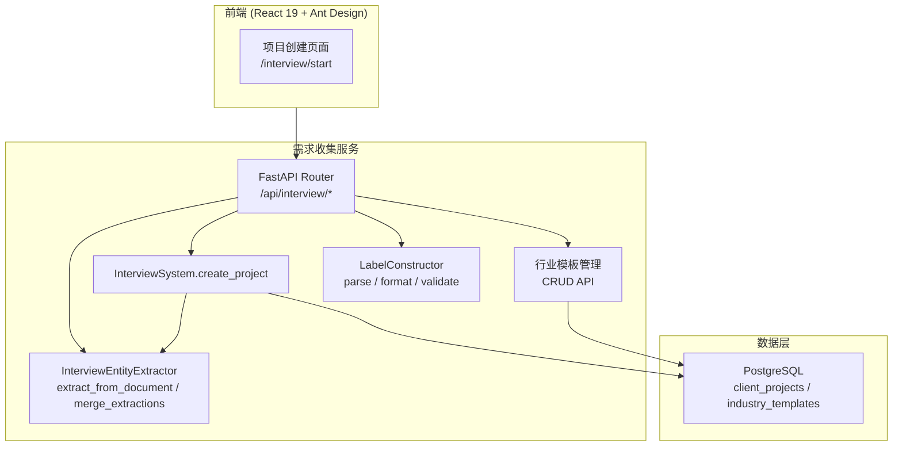

# 设计文档：需求收集子模块（Demand Collection）

## 概述

`demand-collection` 子模块是 `client-interview` 父模块的入口子模块，负责项目创建、需求文档上传与实体提取、行业模板 CRUD 管理，以及 AI_Friendly_Label 数据模型定义与往返一致性保证。

本子模块提取自父模块 `.kiro/specs/client-interview/`，与父模块中的访谈对话、标签构造、离线导入等子模块存在集成关系。

### 设计目标

- 复用现有技术栈：FastAPI + React 19 + Ant Design + PostgreSQL (JSONB)
- 提供项目创建和文档上传的完整后端 API 与前端页面
- 行业模板 CRUD 管理，预置金融/电商/制造三套模板
- AI_Friendly_Label Pydantic 数据模型定义，保证解析/格式化往返一致性
- 文件解析使用 python-docx / openpyxl / PyPDF2

### 关键设计决策

| 决策 | 选择 | 理由 |
|------|------|------|
| 后端框架 | FastAPI | 复用现有技术栈，异步支持好 |
| 文件解析 | python-docx / openpyxl / PyPDF2 | 成熟的 Python 文件解析库 |
| 数据存储 | PostgreSQL JSONB | 灵活存储结构化需求数据 |
| 前端组件库 | Ant Design | 复用现有 UI 体系 |
| 数据模型 | Pydantic v2 | 强类型校验 + JSON 序列化 |

## 架构

### 子模块架构图



### 与父模块集成点

- **访谈对话子模块**：使用本模块创建的 Project 和加载的 Industry_Template 启动会话
- **标签构造子模块**：使用本模块定义的 Pydantic 数据模型（Entity, Rule, Relation, AIFriendlyLabel）
- **离线导入子模块**：使用本模块的 ExtractionResult 模型和 merge_extractions 方法

## 组件与接口

### 1. InterviewSystem.create_project

职责：项目创建，存储至 PostgreSQL JSONB

```python
# src/interview/system.py (部分)

class InterviewSystem:
    async def create_project(self, tenant_id: str, data: ProjectCreateRequest) -> Project:
        """创建项目，存储至 PostgreSQL JSONB
        - 校验 ProjectCreateRequest 字段
        - 写入 client_projects 表
        - 返回包含 id 的 Project 对象
        """
```

### 2. InterviewEntityExtractor

职责：复用 `src/ai/` 模块，对上传文档进行实体/属性/关系提取

```python
# src/interview/entity_extractor.py

class InterviewEntityExtractor:
    def __init__(self, ai_extractor):
        """注入现有 src/ai/ 模块的提取器实例"""

    async def extract_from_document(self, file_path: str, file_type: str) -> ExtractionResult:
        """从上传文档中提取实体
        - 根据 file_type 选择解析器（python-docx / openpyxl / PyPDF2）
        - 调用 ai_extractor 执行实体提取
        - 返回 ExtractionResult
        """

    async def merge_extractions(self, results: list[ExtractionResult]) -> ExtractionResult:
        """合并多次提取结果，去重和冲突解决"""
```

### 3. LabelConstructor（解析与格式化部分）

职责：AI_Friendly_Label 的解析、格式化和校验，保证往返一致性

```python
# src/interview/label_constructor.py (本子模块仅涉及 parse/format/validate)

class LabelConstructor:
    def parse(self, json_str: str) -> AIFriendlyLabel:
        """将 JSON 字符串解析为 AIFriendlyLabel 对象
        - 使用 Pydantic model_validate_json 解析
        - 校验结构合法性
        - 不合法时抛出包含具体字段的 ValidationError
        """

    def format(self, label: AIFriendlyLabel) -> str:
        """将 AIFriendlyLabel 对象格式化为标准 JSON 字符串
        - 使用 Pydantic model_dump_json 序列化
        - 保证字段顺序一致
        """

    def validate(self, label: AIFriendlyLabel) -> ValidationResult:
        """校验标签结构是否符合规范
        - 检查 entities/rules/relations 三个顶层字段
        - 返回 ValidationResult（含 is_valid 和 errors 列表）
        """
```

### API 接口定义

```python
# src/interview/router.py (本子模块涉及的端点)

router = APIRouter(prefix="/api/interview", tags=["interview"])

# 项目管理
POST   /api/interview/projects                          # 创建项目
GET    /api/interview/projects                          # 获取项目列表（租户隔离）

# 文档上传与实体提取
POST   /api/interview/{project_id}/upload-document      # 上传需求文档

# 行业模板
GET    /api/interview/templates                          # 获取行业模板列表
POST   /api/interview/templates                          # 新增行业模板
PUT    /api/interview/templates/{template_id}            # 修改行业模板
```

## 数据模型

### PostgreSQL 表结构

```sql
-- 客户项目表
CREATE TABLE client_projects (
    id UUID PRIMARY KEY DEFAULT gen_random_uuid(),
    tenant_id UUID NOT NULL REFERENCES tenants(id),
    name VARCHAR(255) NOT NULL,
    industry VARCHAR(50) NOT NULL CHECK (industry IN ('finance', 'ecommerce', 'manufacturing')),
    business_domain TEXT,
    raw_requirements JSONB DEFAULT '{}',
    status VARCHAR(20) DEFAULT 'active',
    created_at TIMESTAMPTZ DEFAULT NOW(),
    updated_at TIMESTAMPTZ DEFAULT NOW()
);
CREATE INDEX idx_projects_tenant ON client_projects(tenant_id);

-- 行业模板表
CREATE TABLE industry_templates (
    id UUID PRIMARY KEY DEFAULT gen_random_uuid(),
    name VARCHAR(100) NOT NULL,
    industry VARCHAR(50) NOT NULL,
    system_prompt TEXT NOT NULL,
    config JSONB DEFAULT '{}',
    is_builtin BOOLEAN DEFAULT false,
    created_at TIMESTAMPTZ DEFAULT NOW(),
    updated_at TIMESTAMPTZ DEFAULT NOW()
);
```

### Pydantic 数据模型

```python
from pydantic import BaseModel, Field
from typing import Optional
from uuid import UUID
from datetime import datetime

class EntityAttribute(BaseModel):
    name: str
    type: str
    required: bool = False

class Entity(BaseModel):
    id: str
    name: str
    type: str
    attributes: list[EntityAttribute] = []
    source: Optional[str] = None

class Rule(BaseModel):
    id: str
    name: str
    condition: str
    action: str
    priority: str = "medium"
    related_entities: list[str] = []

class Relation(BaseModel):
    id: str
    source_entity: str
    target_entity: str
    relation_type: str
    attributes: dict = {}

class AIFriendlyLabel(BaseModel):
    entities: list[Entity] = []
    rules: list[Rule] = []
    relations: list[Relation] = []

class ProjectCreateRequest(BaseModel):
    name: str = Field(..., min_length=1, max_length=255)
    industry: str = Field(..., pattern="^(finance|ecommerce|manufacturing)$")
    business_domain: Optional[str] = None

class ExtractionResult(BaseModel):
    entities: list[Entity] = []
    rules: list[Rule] = []
    relations: list[Relation] = []
    confidence: float = 0.0

class ErrorResponse(BaseModel):
    error: str
    message: str
    details: dict = {}
    request_id: str
```

### AI_Friendly_Label JSON 结构

```json
{
  "entities": [
    {
      "id": "entity_001",
      "name": "客户账户",
      "type": "business_object",
      "attributes": [
        { "name": "账户类型", "type": "string", "required": true },
        { "name": "余额", "type": "number", "required": true }
      ],
      "source": "interview_session_abc"
    }
  ],
  "rules": [
    {
      "id": "rule_001",
      "name": "账户余额校验",
      "condition": "余额 >= 0",
      "action": "拒绝交易",
      "priority": "high",
      "related_entities": ["entity_001"]
    }
  ],
  "relations": [
    {
      "id": "rel_001",
      "source_entity": "entity_001",
      "target_entity": "entity_002",
      "relation_type": "belongs_to",
      "attributes": {}
    }
  ]
}
```

## 正确性属性

### Property 1: 项目创建持久化

*For any* 合法的项目创建请求（包含有效的项目名称、行业选择和业务领域），提交后应在 PostgreSQL `client_projects` 表中产生一条新记录，且记录中的 JSONB 字段包含原始请求数据。

**验证: 需求 1.2**

### Property 2: 文档上传触发实体提取

*For any* 支持格式（Word/Excel/PDF）的需求文档上传，Entity_Extractor 应被调用并返回包含 entities、rules、relations 的结构化 ExtractionResult。

**验证: 需求 1.4**

### Property 3: 标签生成结构合规

*For any* 项目的访谈提取结果集合，调用 Label_Constructor 生成的 AI_Friendly_Label 应包含 `entities`（数组）、`rules`（数组）和 `relations`（数组）三个顶层字段，且结构通过 JSON Schema 校验。

**验证: 需求 3.1, 3.2**（对应父模块需求 4.1, 4.5）

### Property 4: 行业模板 CRUD

*For any* 合法的行业模板数据，通过模板配置接口创建后，应能通过查询接口获取到该模板，且内容一致。

**验证: 需求 2.2**

### Property 5: 项目创建自动加载行业模板

*For any* 项目创建请求中指定的行业（finance/ecommerce/manufacturing），启动访谈会话时应自动加载对应行业的 Industry_Template 作为系统提示词。

**验证: 需求 2.3**

### Property 6: AI_Friendly_Label 往返一致性

*For any* 合法的 AI_Friendly_Label JSON 数据，执行 `parse(format(parse(json)))` 应产生与 `parse(json)` 等价的数据对象。

**验证: 需求 3.1, 3.2, 3.3**

## 错误处理

| 错误类别 | 触发条件 | HTTP 状态码 | 处理方式 |
|----------|----------|-------------|----------|
| 文件格式不支持 | 上传非 Word/Excel/PDF 文件 | 400 | 返回支持格式列表 |
| 文件解析失败 | 文档内容损坏或无法解析 | 422 | 返回失败原因 |
| 项目名称重复 | 同租户下项目名称冲突 | 409 | 返回冲突提示 |
| AI_Friendly_Label 校验失败 | JSON 不符合结构规范 | 422 | 返回具体校验失败字段 |
| 模板不存在 | 请求的模板 ID 无效 | 404 | 返回资源不存在 |
| 认证失败 | JWT 缺失或过期 | 401 | 返回未认证错误 |

## 测试策略

### 属性测试（Hypothesis）

| 属性编号 | 属性名称 | 测试文件 | 生成器 |
|----------|----------|----------|--------|
| Property 1 | 项目创建持久化 | `tests/interview/test_project_properties.py` | 随机项目名称、行业、业务领域 |
| Property 2 | 文档上传触发提取 | `tests/interview/test_extraction_properties.py` | 随机 Word/Excel/PDF 文件 |
| Property 3 | 标签结构合规 | `tests/interview/test_label_properties.py` | 随机 ExtractionResult |
| Property 4 | 行业模板 CRUD | `tests/interview/test_template_properties.py` | 随机模板数据 |
| Property 5 | 行业模板自动加载 | `tests/interview/test_template_properties.py` | 随机行业选择 |
| Property 6 | AI_Friendly_Label 往返一致性 | `tests/interview/test_label_roundtrip.py` | 随机合法 AIFriendlyLabel |
