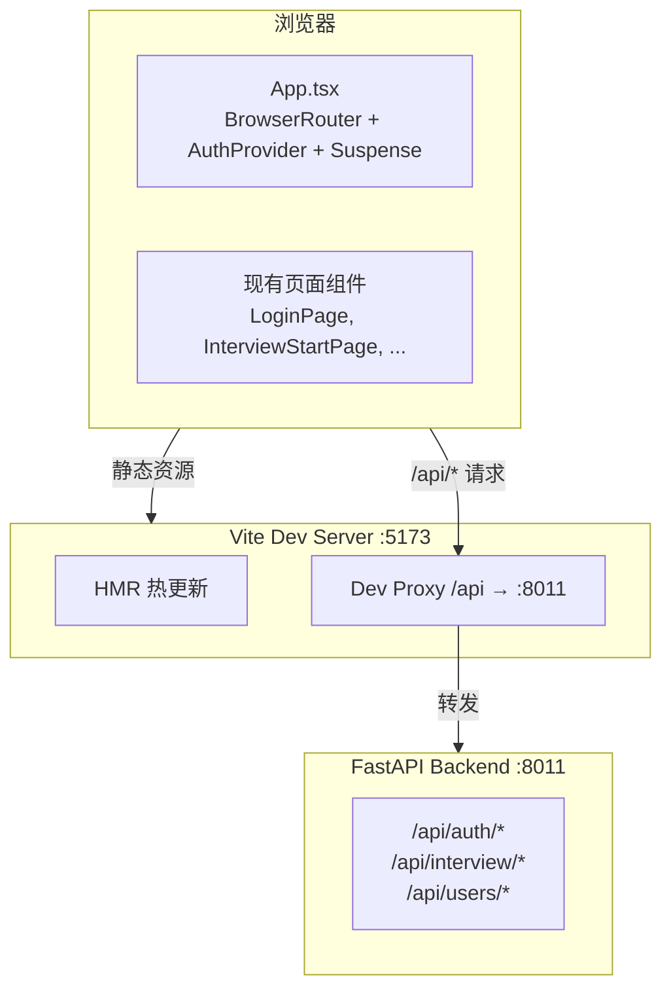

# 技术设计文档：Frontend Scaffold

## 概述

本设计为现有 React 前端组件搭建完整的 Vite + React + TypeScript 构建脚手架。项目已有完整的页面组件（7 个页面）、路由定义（`interviewRoutes.tsx`）、认证上下文（`AuthContext.tsx`）、国际化配置（`i18n/index.ts`）和 API 服务层（`services/api.ts`），但缺少构建入口文件。

本设计将创建以下文件，使前端可作为独立开发服务器运行，并通过 Vite 代理连接后端 FastAPI 服务（端口 8011）：

- `src/frontend/package.json` — 依赖声明与脚本命令
- `src/frontend/vite.config.ts` — Vite 构建配置与开发代理
- `src/frontend/index.html` — HTML 入口文件
- `src/frontend/main.tsx` — React 挂载入口
- `src/frontend/App.tsx` — 根组件（路由 + 认证 + i18n）
- `src/frontend/tsconfig.json` — TypeScript 编译配置

## 架构

### 整体架构



### 文件结构

```
src/frontend/
├── package.json          ← 新建
├── vite.config.ts        ← 新建
├── index.html            ← 新建
├── main.tsx              ← 新建
├── App.tsx               ← 新建
├── tsconfig.json         ← 新建
├── components/           ← 已有
│   ├── LanguageSwitcher.tsx
│   └── ProtectedRoute.tsx
├── contexts/             ← 已有
│   └── AuthContext.tsx
├── i18n/                 ← 已有
│   ├── index.ts
│   └── locales/
├── layouts/              ← 已有
│   └── InterviewLayout.tsx
├── pages/                ← 已有（7 个页面）
├── routes/               ← 已有
│   └── interviewRoutes.tsx
└── services/             ← 已有
    └── api.ts
```

### 设计决策

1. **所有新文件放在 `src/frontend/` 目录下**：Vite 的 `root` 设置为 `src/frontend`，这样所有现有组件的相对导入路径（`../contexts/AuthContext` 等）无需修改。

2. **代理不重写路径**：现有 `api.ts` 中 `baseURL` 为 `/api`，后端路由前缀也是 `/api`，因此代理直接转发，不做路径重写。

3. **使用 React.lazy + Suspense**：现有 `interviewRoutes.tsx` 已使用 `React.lazy` 进行代码分割，`App.tsx` 需要用 `Suspense` 包裹以提供加载回退。

## 组件与接口

### 1. Package_Manifest (`package.json`)

声明项目元数据、脚本命令和依赖。

```json
{
  "name": "superinsight-frontend",
  "version": "0.1.0",
  "private": true,
  "scripts": {
    "dev": "vite",
    "build": "vite build",
    "preview": "vite preview"
  }
}
```

运行时依赖（dependencies）：
| 包名 | 用途 |
|---|---|
| react | UI 框架 |
| react-dom | DOM 渲染 |
| react-router-dom | 路由 |
| antd | UI 组件库 |
| @ant-design/icons | 图标 |
| axios | HTTP 客户端 |
| i18next | 国际化核心 |
| react-i18next | React 国际化绑定 |

开发依赖（devDependencies）：
| 包名 | 用途 |
|---|---|
| vite | 构建工具 |
| @vitejs/plugin-react | React 插件（JSX/TSX） |
| typescript | 类型检查 |
| @types/react | React 类型定义 |
| @types/react-dom | ReactDOM 类型定义 |

### 2. Vite 配置 (`vite.config.ts`)

```typescript
import { defineConfig } from 'vite';
import react from '@vitejs/plugin-react';

export default defineConfig({
  plugins: [react()],
  server: {
    proxy: {
      '/api': {
        target: 'http://localhost:8011',
        changeOrigin: true,
      },
    },
  },
});
```

关键点：
- `root` 不需要在配置文件中显式设置，因为 Vite 默认使用配置文件所在目录作为 root。`vite.config.ts` 放在 `src/frontend/` 下，运行 `npm run dev` 时从该目录启动即可。
- 代理不设置 `rewrite`，保留原始 `/api` 前缀。

### 3. Entry_HTML (`index.html`)

```html
<!DOCTYPE html>
<html lang="zh-CN">
  <head>
    <meta charset="UTF-8" />
    <meta name="viewport" content="width=device-width, initial-scale=1.0" />
    <title>SuperInsight</title>
  </head>
  <body>
    <div id="root"></div>
    <script type="module" src="./main.tsx"></script>
  </body>
</html>
```

### 4. Main_Entry (`main.tsx`)

```typescript
import React from 'react';
import ReactDOM from 'react-dom/client';
import './i18n';
import App from './App';

ReactDOM.createRoot(document.getElementById('root')!).render(
  <React.StrictMode>
    <App />
  </React.StrictMode>
);
```

### 5. App_Component (`App.tsx`)

```typescript
import React, { Suspense } from 'react';
import { BrowserRouter, Routes, Navigate, Route } from 'react-router-dom';
import { Spin } from 'antd';
import { AuthProvider } from './contexts/AuthContext';
import { interviewRoutes } from './routes/interviewRoutes';

const App: React.FC = () => (
  <BrowserRouter>
    <AuthProvider>
      <Suspense fallback={<div style={{ display: 'flex', justifyContent: 'center', alignItems: 'center', height: '100vh' }}><Spin size="large" /></div>}>
        <Routes>
          <Route path="/" element={<Navigate to="/login" replace />} />
          {interviewRoutes}
        </Routes>
      </Suspense>
    </AuthProvider>
  </BrowserRouter>
);

export default App;
```

### 6. TypeScript 配置 (`tsconfig.json`)

```json
{
  "compilerOptions": {
    "target": "ES2020",
    "lib": ["ES2020", "DOM", "DOM.Iterable"],
    "module": "ESNext",
    "moduleResolution": "bundler",
    "jsx": "react-jsx",
    "strict": true,
    "esModuleInterop": true,
    "skipLibCheck": true,
    "forceConsistentCasingInFileNames": true,
    "resolveJsonModule": true,
    "isolatedModules": true,
    "noEmit": true
  },
  "include": ["./**/*.ts", "./**/*.tsx"]
}
```

`include` 使用相对路径 `./**/*.ts`，因为 `tsconfig.json` 本身位于 `src/frontend/` 目录下，这自然将范围限定在该目录。

## 数据模型

本特性不引入新的数据模型。所有数据结构沿用现有定义：

- **User**（`AuthContext.tsx`）：`{ user_id, tenant_id, role, email? }`
- **API 响应**（`services/api.ts`）：通过 axios 拦截器处理 token 刷新和错误
- **i18n 资源**（`i18n/locales/*.json`）：中英文翻译键值对

脚手架文件本身是配置文件（JSON/TypeScript），不涉及运行时数据模型变更。


## 正确性属性

*属性（Property）是指在系统所有有效执行中都应成立的特征或行为——本质上是对系统应做什么的形式化陈述。属性是人类可读规范与机器可验证正确性保证之间的桥梁。*

本特性主要涉及静态配置文件的创建，大部分验收标准适合用示例测试（unit test）验证。经过分析，以下属性可通过属性基测试验证：

### Property 1: 代理路径保留

*For any* 以 `/api` 开头的请求路径，Vite 开发代理应将请求转发到 `http://localhost:8011`，且保留原始请求路径不做任何重写。即对于任意路径 `/api/x`，转发目标应为 `http://localhost:8011/api/x`。

**Validates: Requirements 2.3, 7.1, 7.2, 7.3, 7.4**

### Property 2: package.json 依赖完整性

*For any* 现有前端源文件中的 import 语句引用的第三方包名，该包名应存在于 `package.json` 的 `dependencies` 或 `devDependencies` 中。即源码中使用的所有外部依赖都应在 Package_Manifest 中声明。

**Validates: Requirements 1.3, 1.4, 1.5, 8.1, 8.2, 8.4**

### Property 3: 组件导入路径有效性

*For any* 新建入口文件（`App.tsx`、`main.tsx`）中的相对导入路径，该路径应解析到一个实际存在的文件。即所有相对导入都指向有效的文件位置。

**Validates: Requirements 8.1, 8.2, 8.3, 8.4**

## 错误处理

本特性为构建脚手架，主要错误场景及处理策略：

| 错误场景 | 处理策略 |
|---|---|
| 依赖缺失（`npm install` 未执行） | Vite 启动时报错，提示缺少模块 |
| 后端服务未启动（代理目标不可达） | Vite 代理返回 502 Bad Gateway，前端 axios 拦截器捕获错误 |
| TypeScript 类型错误 | Vite 开发模式下在浏览器 overlay 显示错误，`vite build` 时不阻塞（Vite 默认不做类型检查，需单独运行 `tsc`） |
| `index.html` 中 `#root` 元素缺失 | `ReactDOM.createRoot` 抛出运行时错误 |
| i18n 资源加载失败 | `react-i18next` 使用 `fallbackLng` 回退到中文 |

## 测试策略

### 双重测试方法

本特性采用单元测试 + 属性基测试的双重策略：

- **单元测试**：验证各配置文件的具体内容（字段值、结构）
- **属性基测试**：验证跨所有输入的通用属性（代理路径、依赖完整性、导入路径）

### 属性基测试

- 测试库：**fast-check**（JavaScript/TypeScript 属性基测试库）
- 测试框架：**Vitest**（与 Vite 生态一致）
- 每个属性测试最少运行 100 次迭代
- 每个测试用注释标注对应的设计属性：
  - 格式：`Feature: frontend-scaffold, Property {number}: {property_text}`

### 单元测试

单元测试覆盖以下验收标准（示例测试）：

1. **package.json 结构验证**
   - 验证 `name`、`version`、`private` 字段（需求 1.1）
   - 验证 `scripts` 包含 `dev`、`build`、`preview`（需求 1.2）
   - 验证 `dependencies` 包含所有运行时依赖（需求 1.3）
   - 验证 `devDependencies` 包含所有开发依赖（需求 1.4）

2. **vite.config.ts 验证**
   - 验证文件存在于正确路径（需求 2.1）
   - 验证包含 react 插件配置（需求 2.2）
   - 验证 `changeOrigin: true`（需求 2.4）

3. **index.html 验证**
   - 验证 `id="root"` div 存在（需求 3.2）
   - 验证 script 标签引用 `main.tsx`（需求 3.3）
   - 验证 `lang="zh-CN"` 和 `charset="UTF-8"`（需求 3.4）
   - 验证标题为 "SuperInsight"（需求 3.5）

4. **main.tsx 验证**
   - 验证使用 `createRoot` 和 `StrictMode`（需求 4.2, 4.4）
   - 验证 i18n 导入在渲染之前（需求 4.3）

5. **App.tsx 验证**
   - 验证组件树结构：`BrowserRouter > AuthProvider > Suspense > Routes`（需求 5.2-5.5）
   - 验证根路径重定向到 `/login`（需求 5.6）

6. **tsconfig.json 验证**
   - 验证 `jsx: "react-jsx"`（需求 6.2）
   - 验证 `strict: true`（需求 6.3）
   - 验证 `moduleResolution: "bundler"`（需求 6.4）
   - 验证 `include` 范围（需求 6.5）

### 属性基测试详细规划

每个正确性属性对应一个属性基测试：

- **Feature: frontend-scaffold, Property 1: 代理路径保留** — 生成随机 `/api/*` 路径，验证代理配置将其转发到正确目标且路径不变
- **Feature: frontend-scaffold, Property 2: package.json 依赖完整性** — 扫描所有现有 `.ts`/`.tsx` 文件的 import 语句，提取第三方包名，验证每个包名都在 package.json 中声明
- **Feature: frontend-scaffold, Property 3: 组件导入路径有效性** — 解析新建文件中的相对导入路径，验证每个路径解析到实际存在的文件
