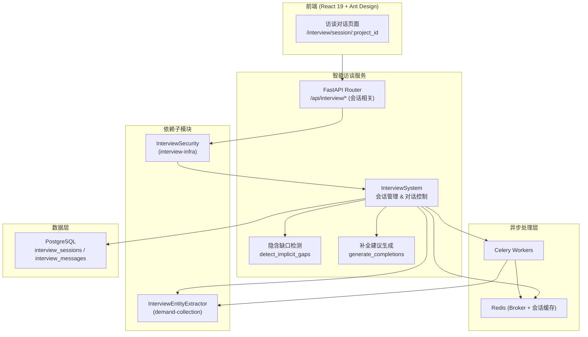
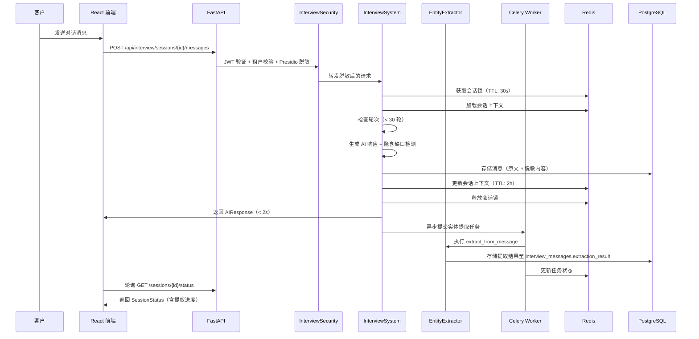

# 设计文档：智能访谈子模块（Intelligent Interview）

## 概述

`intelligent-interview` 子模块是 `client-interview` 父模块的核心交互子模块，负责访谈会话的完整生命周期管理：启动会话、多轮对话交互、隐含信息缺口检测、补全建议生成、会话结束与摘要生成。通过 Redis 缓存活跃会话上下文，Celery 异步处理实体提取等耗时操作，确保每轮对话响应 < 2s。

### 设计目标

- 复用 `demand-collection` 子模块的 Project、Industry_Template、InterviewEntityExtractor
- 复用 `interview-infra` 子模块的 InterviewSecurity（JWT + Presidio + 多租户）
- Redis 缓存活跃会话上下文（TTL: 2h），PostgreSQL 持久化会话和消息
- Celery 异步处理实体提取，确保对话响应 < 2s
- 30 轮自动终止逻辑，防止无限对话
- 前端聊天式对话界面 + 侧边栏实时实体展示

### 关键设计决策

| 决策 | 选择 | 理由 |
|------|------|------|
| 会话状态管理 | Redis + PostgreSQL | Redis 缓存活跃会话（低延迟），PostgreSQL 持久化（可靠性） |
| 异步任务 | Celery + Redis | 复用现有队列，实体提取不阻塞对话响应 |
| 并发控制 | Redis 分布式锁 | 防止同一会话并发消息导致状态不一致 |
| 数据脱敏 | Presidio（复用 interview-infra） | 消息存储前脱敏，满足合规要求 |

### 依赖子模块

| 子模块 | 依赖组件 | 用途 |
|--------|----------|------|
| `demand-collection` | Project, Industry_Template | 会话启动时加载项目和行业模板 |
| `demand-collection` | InterviewEntityExtractor.extract_from_message | 对话消息实体提取 |
| `demand-collection` | Pydantic 模型（Entity, Rule, Relation, ExtractionResult） | 数据结构复用 |
| `interview-infra` | InterviewSecurity | JWT 认证、Presidio 脱敏、多租户隔离 |

## 架构

### 子模块架构图



### 请求处理流程



## 组件与接口

### 1. InterviewSystem（访谈系统核心 — 会话管理部分）

职责：会话生命周期管理、对话交互、隐含缺口检测、补全建议生成

```python
# src/interview/system.py (本子模块涉及的方法)

class InterviewSystem:
    """访谈系统核心 — 会话管理与对话交互"""

    async def start_session(self, project_id: str, tenant_id: str) -> InterviewSession:
        """启动访谈会话
        - 校验 project_id 存在且属于 tenant_id
        - 加载项目关联的 Industry_Template
        - 创建 interview_sessions 记录（status='active', current_round=0, max_rounds=30）
        - 初始化 Redis 会话缓存（TTL: 2h）
        - 返回 InterviewSession 对象
        """

    async def send_message(self, session_id: str, tenant_id: str, message: str) -> AIResponse:
        """处理客户消息
        - 获取 Redis 会话锁（TTL: 30s），防止并发
        - 从 Redis 加载会话上下文
        - 调用 InterviewSecurity.sanitize_content 脱敏
        - 检查 current_round < max_rounds（30），超限则自动结束
        - 生成 AI 响应
        - 调用 detect_implicit_gaps 检测隐含缺口
        - 存储消息至 PostgreSQL（原文 + 脱敏内容）
        - 更新 Redis 会话上下文（current_round + 1, TTL: 2h）
        - 异步提交 Celery 实体提取任务
        - 释放会话锁
        - 返回 AIResponse
        """

    async def detect_implicit_gaps(self, session_id: str) -> list[ImplicitGap]:
        """分析对话上下文，检测隐含信息缺口
        - 从 Redis 加载会话上下文（完整对话历史）
        - 基于行业模板和对话内容分析缺失信息
        - 返回 ImplicitGap 列表（每个含 gap_description 和 suggested_question）
        """

    async def generate_completions(self, session_id: str) -> list[CompletionSuggestion]:
        """基于上下文生成 5 条补全建议
        - 从 Redis 加载会话上下文
        - 分析已收集信息和缺失维度
        - 生成恰好 5 条 CompletionSuggestion
        - 每条包含 suggestion_text 和 category
        """

    async def end_session(self, session_id: str, tenant_id: str) -> InterviewSummary:
        """结束会话
        - 校验会话属于 tenant_id 且 status='active'
        - 从 Redis 加载完整对话历史
        - 生成 Interview_Summary（对话摘要 + 实体-规则-属性列表）
        - 更新 interview_sessions 记录（status='completed', summary=JSONB, ended_at=NOW()）
        - 清理 Redis 会话缓存
        - 返回 InterviewSummary
        """

    async def get_session_status(self, session_id: str) -> SessionStatus:
        """获取会话状态
        - 从 Redis 读取会话上下文和异步任务状态
        - 返回 SessionStatus（current_round, max_rounds, status, pending_tasks）
        """
```

### API 接口定义

```python
# src/interview/router.py (本子模块涉及的端点)

router = APIRouter(prefix="/api/interview", tags=["interview"])

# 访谈会话
POST   /api/interview/{project_id}/sessions             # 启动访谈会话
POST   /api/interview/sessions/{session_id}/messages     # 发送对话消息
POST   /api/interview/sessions/{session_id}/end          # 结束会话
GET    /api/interview/sessions/{session_id}/status       # 获取会话状态/进度
POST   /api/interview/sessions/{session_id}/completions  # 生成补全建议
```

### 接口请求/响应详情

#### POST /api/interview/{project_id}/sessions

请求：无 body（project_id 从 URL 获取，tenant_id 从 JWT 获取）

响应：
```json
{
  "session_id": "uuid",
  "project_id": "uuid",
  "status": "active",
  "current_round": 0,
  "max_rounds": 30,
  "template_name": "金融行业模板",
  "created_at": "2024-01-01T00:00:00Z"
}
```

#### POST /api/interview/sessions/{session_id}/messages

请求：
```json
{ "content": "我们的客户账户需要支持多种账户类型..." }
```

响应：
```json
{
  "message": "了解，您提到了多种账户类型。请问具体有哪些类型？每种类型有什么不同的业务规则？",
  "implicit_gaps": [
    {
      "gap_description": "账户类型的具体分类未明确",
      "suggested_question": "请列举您系统中的所有账户类型"
    }
  ],
  "current_round": 5,
  "max_rounds": 30
}
```

#### POST /api/interview/sessions/{session_id}/end

请求：无 body

响应：
```json
{
  "session_id": "uuid",
  "summary": "本次访谈共进行 15 轮对话，收集了 8 个业务实体...",
  "entities": [...],
  "rules": [...],
  "relations": [...],
  "total_rounds": 15,
  "ended_at": "2024-01-01T01:00:00Z"
}
```

#### GET /api/interview/sessions/{session_id}/status

响应：
```json
{
  "session_id": "uuid",
  "status": "active",
  "current_round": 12,
  "max_rounds": 30,
  "pending_tasks": [
    { "task_id": "uuid", "type": "entity_extraction", "status": "processing" }
  ]
}
```

#### POST /api/interview/sessions/{session_id}/completions

请求：无 body

响应：
```json
{
  "suggestions": [
    { "suggestion_text": "建议补充账户冻结的触发条件和解冻流程", "category": "business_rule" },
    { "suggestion_text": "建议明确不同账户类型的权限差异", "category": "entity_attribute" },
    { "suggestion_text": "建议描述账户与交易之间的关联关系", "category": "relation" },
    { "suggestion_text": "建议补充异常交易的处理规则", "category": "business_rule" },
    { "suggestion_text": "建议说明账户状态变更的审批流程", "category": "workflow" }
  ]
}
```

## 数据模型

### PostgreSQL 表结构（本子模块管理）

```sql
-- 访谈会话表
CREATE TABLE interview_sessions (
    id UUID PRIMARY KEY DEFAULT gen_random_uuid(),
    project_id UUID NOT NULL REFERENCES client_projects(id),
    tenant_id UUID NOT NULL,
    current_round INT DEFAULT 0,
    max_rounds INT DEFAULT 30,
    status VARCHAR(20) DEFAULT 'active' CHECK (status IN ('active', 'completed', 'terminated')),
    template_id UUID REFERENCES industry_templates(id),
    summary JSONB,
    created_at TIMESTAMPTZ DEFAULT NOW(),
    ended_at TIMESTAMPTZ
);
CREATE INDEX idx_sessions_project ON interview_sessions(project_id);

-- 对话消息表
CREATE TABLE interview_messages (
    id UUID PRIMARY KEY DEFAULT gen_random_uuid(),
    session_id UUID NOT NULL REFERENCES interview_sessions(id),
    role VARCHAR(10) NOT NULL CHECK (role IN ('user', 'assistant', 'system')),
    content TEXT NOT NULL,
    sanitized_content TEXT NOT NULL,  -- Presidio 脱敏后的内容
    extraction_result JSONB,
    implicit_gaps JSONB,
    round_number INT NOT NULL,
    created_at TIMESTAMPTZ DEFAULT NOW()
);
CREATE INDEX idx_messages_session ON interview_messages(session_id);
```

### Redis 缓存结构

```
# 活跃会话上下文缓存（TTL: 2h）
interview:session:{session_id}:context -> JSON {
  messages: [{ role, content, round_number }],
  current_round: N,
  template: { id, name, system_prompt },
  project_id: "uuid",
  tenant_id: "uuid"
}

# 异步任务状态
interview:task:{task_id}:status -> JSON {
  status: "processing" | "completed" | "failed",
  result: { entities: [], rules: [], relations: [] }
}

# 会话锁（防止并发消息，TTL: 30s）
interview:session:{session_id}:lock -> 1 (TTL: 30s)
```

### Pydantic 数据模型（本子模块新增）

```python
from pydantic import BaseModel, Field
from typing import Optional
from uuid import UUID
from datetime import datetime

class InterviewMessage(BaseModel):
    """客户发送的对话消息"""
    content: str = Field(..., min_length=1)

class ImplicitGap(BaseModel):
    """隐含信息缺口"""
    gap_description: str
    suggested_question: str

class AIResponse(BaseModel):
    """AI 对话响应"""
    message: str
    implicit_gaps: list[ImplicitGap] = []
    current_round: int
    max_rounds: int

class CompletionSuggestion(BaseModel):
    """补全建议"""
    suggestion_text: str
    category: str  # business_rule, entity_attribute, relation, workflow

class InterviewSummary(BaseModel):
    """访谈摘要"""
    session_id: str
    summary: str
    entities: list[dict] = []
    rules: list[dict] = []
    relations: list[dict] = []
    total_rounds: int
    ended_at: datetime

class SessionStatus(BaseModel):
    """会话状态"""
    session_id: str
    status: str  # active, completed, terminated
    current_round: int
    max_rounds: int
    pending_tasks: list[dict] = []

class PendingTask(BaseModel):
    """异步任务状态"""
    task_id: str
    type: str  # entity_extraction
    status: str  # processing, completed, failed
```

### 复用的 Pydantic 模型（来自 demand-collection）

- `Entity`, `Rule`, `Relation`, `ExtractionResult` — 实体提取结果结构
- `AIFriendlyLabel` — 标签数据结构
- `ProjectCreateRequest` — 项目创建请求（用于关联查询）

## Celery 异步任务

```python
# src/interview/tasks.py

from celery import shared_task

@shared_task(bind=True, max_retries=3, default_retry_delay=5)
def extract_entities_task(self, session_id: str, message_id: str, message: str, context: list[dict]):
    """异步实体提取任务
    - 调用 InterviewEntityExtractor.extract_from_message
    - 将结果写入 interview_messages.extraction_result (JSONB)
    - 更新 Redis 任务状态
    - 失败时指数退避重试（最多 3 次）
    """
```

### 30 轮自动终止逻辑

```python
# send_message 方法内部逻辑伪代码

async def send_message(self, session_id, tenant_id, message):
    # 1. 获取会话锁
    lock = await redis.set(f"interview:session:{session_id}:lock", 1, nx=True, ex=30)
    if not lock:
        raise ConcurrentMessageError("会话正在处理中，请稍后重试")

    try:
        # 2. 加载上下文
        context = await redis.get(f"interview:session:{session_id}:context")
        current_round = context["current_round"]

        # 3. 检查轮次
        if current_round >= 30:
            # 自动结束会话
            return await self.end_session(session_id, tenant_id)

        # 4. Presidio 脱敏
        sanitized = security.sanitize_content(message)

        # 5. 生成 AI 响应 + 缺口检测
        ai_response = await self._generate_response(context, sanitized)
        gaps = await self.detect_implicit_gaps(session_id)

        # 6. 存储消息
        await self._store_message(session_id, message, sanitized, current_round + 1)

        # 7. 更新 Redis（轮次 +1, TTL 刷新 2h）
        context["current_round"] = current_round + 1
        await redis.setex(f"interview:session:{session_id}:context", 7200, json.dumps(context))

        # 8. 异步提交实体提取
        extract_entities_task.delay(session_id, message_id, sanitized, context["messages"])

        return AIResponse(
            message=ai_response,
            implicit_gaps=gaps,
            current_round=current_round + 1,
            max_rounds=30
        )
    finally:
        # 9. 释放锁
        await redis.delete(f"interview:session:{session_id}:lock")
```

## 正确性属性

### Property 1: 对话消息触发实体提取

*For any* 访谈会话中的客户消息，发送后 Entity_Extractor 应被异步调用，并产生包含 entities、rules、relations 的 ExtractionResult。

**验证: 需求 1.3**（对应父模块需求 2.3）

### Property 2: 会话最大轮次自动终止

*For any* 访谈会话，当对话轮次达到 30 轮时，会话状态应自动变为 `completed`，不允许继续发送消息。

**验证: 需求 1.5**（对应父模块需求 2.5）

### Property 3: 会话结束生成摘要

*For any* 已结束的访谈会话（无论是达到最大轮次还是客户主动结束），系统应生成非空的 Interview_Summary 和实体-规则-属性列表。

**验证: 需求 1.6**（对应父模块需求 2.6）

### Property 4: 隐含缺口检测与引导问题生成

*For any* 对话轮次结束后的上下文，系统应执行隐含信息缺口检测；当检测到缺口时，应生成至少一个引导性问题。

**验证: 需求 2.1, 2.2**（对应父模块需求 3.1, 3.2）

### Property 5: 一键补全生成 5 条建议

*For any* 访谈会话上下文，调用补全建议接口应返回恰好 5 条 CompletionSuggestion。

**验证: 需求 2.3**（对应父模块需求 3.3）

## 错误处理

| 错误类别 | 触发条件 | HTTP 状态码 | 处理方式 |
|----------|----------|-------------|----------|
| 认证失败 | JWT 缺失或过期 | 401 | 返回 `{"error": "unauthorized"}` |
| 权限不足 | 跨租户访问会话 | 403 | 返回 `{"error": "forbidden"}` |
| 会话不存在 | session_id 无效 | 404 | 返回 `{"error": "not_found"}` |
| 项目不存在 | project_id 无效 | 404 | 返回 `{"error": "not_found"}` |
| 会话已结束 | 向已完成的会话发送消息 | 409 | 返回会话状态冲突提示 |
| 并发消息 | 同一会话同时发送多条消息 | 409 | 返回 "会话正在处理中，请稍后重试" |
| 消息内容为空 | content 字段为空 | 400 | 返回字段校验错误 |
| 实体提取超时 | Celery 任务超时 | — | 任务自动重试（最多 3 次），前端轮询获取状态 |

### 异步任务错误处理

- Celery 任务失败时自动重试（最多 3 次，指数退避：5s → 25s → 125s）
- 任务状态通过 Redis 实时更新（processing → completed / failed）
- 前端通过 GET /sessions/{id}/status 轮询获取任务进度
- 最终失败的任务在 Redis 中标记为 failed，包含错误详情

## 测试策略

### 属性测试（Hypothesis）

| 属性编号 | 属性名称 | 测试文件 | 生成器 |
|----------|----------|----------|--------|
| Property 1 | 对话消息触发实体提取 | `tests/interview/test_session_properties.py` | 随机对话消息文本 |
| Property 2 | 会话最大轮次自动终止 | `tests/interview/test_session_properties.py` | 随机会话 + 轮次序列 |
| Property 3 | 会话结束生成摘要 | `tests/interview/test_session_properties.py` | 随机会话对话历史 |
| Property 4 | 隐含缺口检测与引导 | `tests/interview/test_gap_properties.py` | 随机对话上下文 |
| Property 5 | 一键补全 5 条建议 | `tests/interview/test_gap_properties.py` | 随机会话上下文 |

### 属性测试示例

```python
# tests/interview/test_session_properties.py
# Feature: intelligent-interview, Property 2: 会话最大轮次自动终止

from hypothesis import given, settings, assume
from hypothesis import strategies as st

@settings(max_examples=100)
@given(num_rounds=st.integers(min_value=30, max_value=50))
def test_session_auto_terminate_at_max_rounds(num_rounds, mock_interview_system):
    """
    Feature: intelligent-interview, Property 2: 会话最大轮次自动终止
    For any session reaching 30 rounds, status should become 'completed'
    """
    session = mock_interview_system.start_session(project_id="test", tenant_id="test")
    for i in range(num_rounds):
        response = mock_interview_system.send_message(session.id, "test", f"消息 {i}")
        if i >= 29:
            assert session.status == "completed"
            break
```

```python
# tests/interview/test_gap_properties.py
# Feature: intelligent-interview, Property 5: 一键补全生成 5 条建议

from hypothesis import given, settings
from hypothesis import strategies as st

@settings(max_examples=100)
@given(context_messages=st.lists(st.text(min_size=1, max_size=200), min_size=1, max_size=20))
def test_completions_always_return_five(context_messages, mock_interview_system):
    """
    Feature: intelligent-interview, Property 5: 一键补全生成 5 条建议
    For any session context, completions endpoint returns exactly 5 suggestions
    """
    session = mock_interview_system.start_session(project_id="test", tenant_id="test")
    for msg in context_messages:
        mock_interview_system.send_message(session.id, "test", msg)
    suggestions = mock_interview_system.generate_completions(session.id)
    assert len(suggestions) == 5
    assert all(isinstance(s, CompletionSuggestion) for s in suggestions)
```

### 单元测试计划

| 测试范围 | 测试文件 | 关键测试用例 |
|----------|----------|-------------|
| 会话管理 | `tests/interview/test_session.py` | 会话创建、模板加载、第 30 轮自动结束、重复结束幂等 |
| 对话交互 | `tests/interview/test_chat.py` | 空消息拒绝、已结束会话拒绝消息、并发消息拒绝 |
| 缺口检测 | `tests/interview/test_gaps.py` | 缺口检测返回引导问题、无缺口时返回空列表 |
| 补全建议 | `tests/interview/test_completions.py` | 返回 5 条建议、建议包含 category |
| 异步任务 | `tests/interview/test_celery_tasks.py` | 任务提交、重试逻辑、超时处理 |
| Redis 缓存 | `tests/interview/test_redis_cache.py` | 上下文缓存 TTL、会话锁获取/释放 |
| 前端对话 | `tests/interview/test_chat_page.tsx` | 消息发送、AI 响应展示、侧边栏实体展示、30 轮提示 |