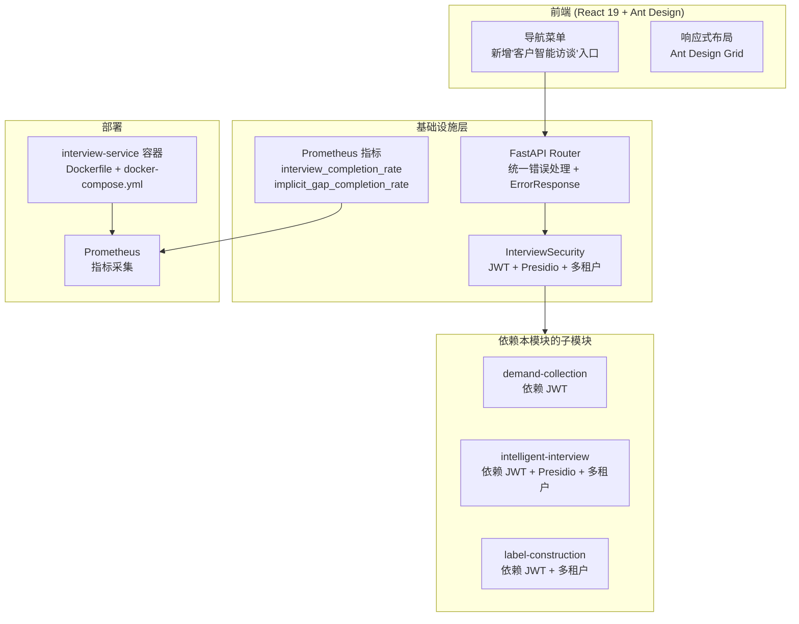

# 设计文档：基础设施子模块（Interview Infrastructure）

## 概述

`interview-infra` 子模块是 `client-interview` 父模块的基础层，为所有其他子模块提供安全认证、数据脱敏、多租户隔离、统一错误处理、Prometheus 监控、Docker 部署配置和前端导航入口。

本子模块提取自父模块 `.kiro/specs/client-interview/`，是一个基础（FOUNDATION）模块，其他子模块依赖关系如下：
- `demand-collection` 依赖：JWT 认证
- `intelligent-interview` 依赖：InterviewSecurity（JWT + Presidio + 多租户）
- `label-construction` 依赖：InterviewSecurity（JWT + 多租户）

### 设计目标

- 复用现有 JWT 认证中间件，封装为访谈模块统一安全层
- 集成 Presidio 实现对话内容敏感信息脱敏
- 基于 tenant_id 实现多租户数据隔离
- 提供 FastAPI Router 统一错误处理和 ErrorResponse 格式
- 复用 Prometheus 监控体系，新增访谈业务指标
- 以 Docker 容器方式部署，无缝集成现有 docker-compose.yml
- 在 React Router 导航菜单中新增访谈入口，Ant Design 响应式布局

### 关键设计决策

| 决策 | 选择 | 理由 |
|------|------|------|
| 认证机制 | 复用现有 JWT 中间件 | 避免重复建设，保持一致性 |
| 数据脱敏 | Presidio | 需求指定，微软开源方案，支持中文 PII |
| 多租户隔离 | tenant_id 字段 + 查询过滤 | 简单有效，复用现有租户体系 |
| 监控 | Prometheus + prometheus_client | 复用现有监控基础设施 |
| 部署 | Docker Compose 新增容器 | 不影响现有服务，独立扩缩容 |
| 前端路由 | React Router | 复用现有路由体系 |

## 架构

### 子模块架构图



### 与其他子模块集成点

- **demand-collection**：通过 JWT 认证中间件保护项目创建和文档上传 API
- **intelligent-interview**：通过 InterviewSecurity 完整安全层（JWT + Presidio 脱敏 + 多租户隔离）保护对话 API
- **label-construction**：通过 InterviewSecurity（JWT + 多租户隔离）保护标签生成和同步 API

## 组件与接口

### 1. InterviewSecurity（安全层）

职责：JWT 认证校验、Presidio 数据脱敏、多租户数据隔离

```python
# src/interview/security.py

from presidio_analyzer import AnalyzerEngine
from presidio_anonymizer import AnonymizerEngine

class InterviewSecurity:
    """访谈模块安全层，复用现有 JWT 机制，集成 Presidio 脱敏"""

    def __init__(self):
        self.analyzer = AnalyzerEngine()
        self.anonymizer = AnonymizerEngine()

    async def verify_tenant_access(self, tenant_id: str, project_id: str) -> bool:
        """校验租户是否有权访问指定项目
        - 查询 client_projects 表中 project_id 对应的 tenant_id
        - 比对请求租户与项目所属租户
        - 不匹配时返回 False（调用方返回 HTTP 403）
        """

    def sanitize_content(self, text: str) -> str:
        """使用 Presidio 对文本进行敏感信息去标识化
        - 支持检测：手机号、身份证号、邮箱、银行卡号、姓名等 PII
        - 将检测到的 PII 替换为占位符（如 <PHONE_NUMBER>）
        - 返回脱敏后的文本
        """

    def get_current_tenant(self, token: str) -> str:
        """从 JWT token 中提取租户 ID
        - 解码 JWT token
        - 提取 tenant_id claim
        - token 无效时抛出认证异常
        """
```

### 2. FastAPI Router 统一错误处理

职责：汇总所有 API 端点路由，提供统一错误响应格式和 HTTP 状态码映射

```python
# src/interview/router.py

from fastapi import APIRouter, Depends, HTTPException
from src.interview.security import InterviewSecurity

router = APIRouter(prefix="/api/interview", tags=["interview"])

class ErrorResponse(BaseModel):
    error: str          # 错误类型标识
    message: str        # 人类可读的错误描述
    details: dict = {}  # 附加详情（如失败字段、行号等）
    request_id: str     # 请求追踪 ID

# JWT 认证依赖注入
async def get_current_tenant(token: str = Depends(oauth2_scheme)) -> str:
    """从 JWT 提取 tenant_id，无效 token 返回 HTTP 401"""

# 租户访问校验依赖注入
async def verify_project_access(
    project_id: str,
    tenant_id: str = Depends(get_current_tenant)
) -> str:
    """校验租户对项目的访问权限，无权限返回 HTTP 403"""

# 统一异常处理器
@app.exception_handler(HTTPException)
async def http_exception_handler(request, exc):
    """将 HTTPException 转换为 ErrorResponse 格式"""

@app.exception_handler(ValidationError)
async def validation_exception_handler(request, exc):
    """将 Pydantic ValidationError 转换为 HTTP 422 + ErrorResponse"""
```

### 错误码映射

| 错误类别 | 触发条件 | HTTP 状态码 | error 字段 |
|----------|----------|-------------|------------|
| 认证失败 | JWT 缺失或过期 | 401 | `unauthorized` |
| 权限不足 | 跨租户访问 | 403 | `forbidden` |
| 资源不存在 | 项目/会话 ID 无效 | 404 | `not_found` |
| 参数错误 | 文件格式不支持等 | 400 | `bad_request` |
| 状态冲突 | 会话已结束 | 409 | `conflict` |
| 校验失败 | 数据结构不合法 | 422 | `validation_error` |
| 上游服务失败 | Label Studio 连接失败 | 502 | `bad_gateway` |
| 超时 | Celery 任务超时 | 504 | `gateway_timeout` |

### 3. Prometheus 指标上报

职责：定义和上报访谈业务监控指标

```python
# src/interview/metrics.py

from prometheus_client import Counter, Histogram, Gauge

# 访谈完成率指标
interview_sessions_total = Counter(
    'interview_sessions_total',
    'Total number of interview sessions',
    ['status']  # active, completed, terminated
)

interview_completion_rate = Gauge(
    'interview_completion_rate',
    'Interview session completion rate'
)

# 隐含信息补全率指标
implicit_gap_total = Counter(
    'implicit_gap_total',
    'Total number of implicit gaps detected'
)

implicit_gap_completed = Counter(
    'implicit_gap_completed',
    'Number of implicit gaps completed by user'
)

implicit_gap_completion_rate = Gauge(
    'implicit_gap_completion_rate',
    'Implicit gap completion rate'
)

# 请求延迟
interview_request_duration = Histogram(
    'interview_request_duration_seconds',
    'Interview API request duration',
    ['endpoint', 'method']
)

def report_session_completed(session_id: str, gaps_detected: int, gaps_completed: int):
    """会话完成时上报指标
    - 更新 interview_sessions_total
    - 计算并更新 interview_completion_rate
    - 更新 implicit_gap_total 和 implicit_gap_completed
    - 计算并更新 implicit_gap_completion_rate
    """
```

### 4. Docker 部署配置

职责：interview-service 容器定义和 Docker Compose 集成

```dockerfile
# Dockerfile
FROM python:3.11-slim

WORKDIR /app
COPY requirements.txt .
RUN pip install --no-cache-dir -r requirements.txt

COPY src/ ./src/
COPY alembic/ ./alembic/
COPY alembic.ini .

EXPOSE 8001
CMD ["uvicorn", "src.interview.main:app", "--host", "0.0.0.0", "--port", "8001"]
```

```yaml
# docker-compose.yml 新增部分
services:
  interview-service:
    build:
      context: .
      dockerfile: Dockerfile.interview
    ports:
      - "8001:8001"
    environment:
      - DATABASE_URL=postgresql://...
      - REDIS_URL=redis://redis:6379/0
      - JWT_SECRET=${JWT_SECRET}
      - PROMETHEUS_ENABLED=true
    depends_on:
      - postgres
      - redis
    networks:
      - superinsight-network
    healthcheck:
      test: ["CMD", "curl", "-f", "http://localhost:8001/health"]
      interval: 30s
      timeout: 10s
      retries: 3
```

### 5. React Router 导航入口

职责：在现有导航菜单中新增"客户智能访谈"入口，Ant Design 响应式布局

```tsx
// src/components/Navigation.tsx (新增菜单项)

import { Menu } from 'antd';
import { MessageOutlined } from '@ant-design/icons';
import { useNavigate } from 'react-router-dom';

// 在现有菜单 items 中新增
const interviewMenuItem = {
  key: 'interview',
  icon: <MessageOutlined />,
  label: '客户智能访谈',
  onClick: () => navigate('/interview/start'),
};
```

```tsx
// src/routes/index.tsx (新增路由)

import { Route } from 'react-router-dom';

<Route path="/interview/start" element={<InterviewStartPage />} />
<Route path="/interview/session/:projectId" element={<InterviewSessionPage />} />
```

```tsx
// src/layouts/InterviewLayout.tsx (响应式布局)

import { Layout, Grid } from 'antd';
const { useBreakpoint } = Grid;

const InterviewLayout: React.FC = ({ children }) => {
  const screens = useBreakpoint();
  // screens.md 以上：侧边栏 + 主内容区
  // screens.md 以下：折叠侧边栏，全宽主内容区
  return (
    <Layout>
      {screens.md && <Layout.Sider>...</Layout.Sider>}
      <Layout.Content>{children}</Layout.Content>
    </Layout>
  );
};
```

## 正确性属性

### Property 1: Presidio 敏感信息脱敏

*For any* 包含已知 PII 模式（如手机号、身份证号、邮箱地址）的对话消息，经 Presidio 处理后的 `sanitized_content` 不应包含原始敏感信息。

**验证: 需求 1.1**（对应父模块 Property 15）

### Property 2: 多租户数据隔离

*For any* 租户 A 和租户 B，租户 A 请求访问租户 B 的项目数据时，系统应拒绝请求并返回权限不足的错误响应（HTTP 403）。

**验证: 需求 1.2, 1.3**（对应父模块 Property 16）

### Property 3: JWT 认证校验

*For any* 访谈相关 API 请求，若不携带有效 JWT token，系统应拒绝请求并返回未认证错误（HTTP 401）。

**验证: 需求 1.4**（对应父模块 Property 17）

### Property 4: Prometheus 指标上报

*For any* 已完成的访谈会话，系统应向 Prometheus 上报访谈完成率和隐含信息补全率指标，且指标值在合法范围内（0.0 ~ 1.0）。

**验证: 需求 3.2, 3.3**（对应父模块 Property 18）

## 错误处理

本子模块定义了统一的错误处理机制，供所有子模块复用：

| 错误类别 | 触发条件 | HTTP 状态码 | 处理方式 |
|----------|----------|-------------|----------|
| 认证失败 | JWT 缺失或过期 | 401 | 返回 `{"error": "unauthorized", "message": "..."}` |
| 权限不足 | 跨租户访问 | 403 | 返回 `{"error": "forbidden", "message": "..."}` |
| 资源不存在 | 项目/会话 ID 无效 | 404 | 返回 `{"error": "not_found", "message": "..."}` |
| 参数错误 | 请求参数不合法 | 400 | 返回 `{"error": "bad_request", "message": "..."}` |
| 状态冲突 | 会话已结束等 | 409 | 返回 `{"error": "conflict", "message": "..."}` |
| 校验失败 | 数据结构不合法 | 422 | 返回 `{"error": "validation_error", "details": {...}}` |
| 上游服务失败 | 外部服务不可达 | 502 | 返回 `{"error": "bad_gateway", "message": "..."}` |
| 超时 | 异步任务超时 | 504 | 返回 `{"error": "gateway_timeout", "message": "..."}` |

## 测试策略

### 属性测试（Hypothesis）

| 属性编号 | 属性名称 | 测试文件 | 生成器 |
|----------|----------|----------|--------|
| Property 1 | Presidio 敏感信息脱敏 | `tests/interview/test_security_properties.py` | 随机含 PII 文本（手机号、身份证号、邮箱） |
| Property 2 | 多租户数据隔离 | `tests/interview/test_security_properties.py` | 随机租户 + 项目组合 |
| Property 3 | JWT 认证校验 | `tests/interview/test_security_properties.py` | 随机 API 端点 + 无效 token |
| Property 4 | Prometheus 指标上报 | `tests/interview/test_metrics_properties.py` | 随机完成的会话数据 |

### 属性测试示例

```python
# tests/interview/test_security_properties.py
# Feature: interview-infra, Property 1: Presidio 敏感信息脱敏

from hypothesis import given, settings
from hypothesis import strategies as st
import re

def pii_text_strategy():
    """生成包含已知 PII 模式的文本"""
    phone = st.from_regex(r'1[3-9]\d{9}', fullmatch=True)
    email = st.emails()
    return st.tuples(
        st.text(min_size=5, max_size=50),
        st.one_of(phone, email)
    ).map(lambda t: f"{t[0]} 联系方式 {t[1]} 请记录")

@settings(max_examples=100)
@given(text_with_pii=pii_text_strategy())
def test_presidio_sanitization(text_with_pii):
    """
    Feature: interview-infra, Property 1: Presidio 敏感信息脱敏
    For any text containing PII, sanitized output should not contain original PII
    """
    security = InterviewSecurity()
    sanitized = security.sanitize_content(text_with_pii)
    # 原始 PII 不应出现在脱敏后的文本中
    phones = re.findall(r'1[3-9]\d{9}', text_with_pii)
    for phone in phones:
        assert phone not in sanitized
```

```python
# tests/interview/test_security_properties.py
# Feature: interview-infra, Property 2: 多租户数据隔离

from hypothesis import given, settings, assume
from hypothesis import strategies as st

@settings(max_examples=100)
@given(
    tenant_a=st.uuids(),
    tenant_b=st.uuids(),
    project_id=st.uuids()
)
def test_tenant_isolation(tenant_a, tenant_b, project_id):
    """
    Feature: interview-infra, Property 2: 多租户数据隔离
    For any two different tenants, tenant A cannot access tenant B's projects
    """
    assume(tenant_a != tenant_b)
    security = InterviewSecurity()
    create_project(tenant_id=tenant_a, project_id=project_id)
    assert not await security.verify_tenant_access(str(tenant_b), str(project_id))
```
