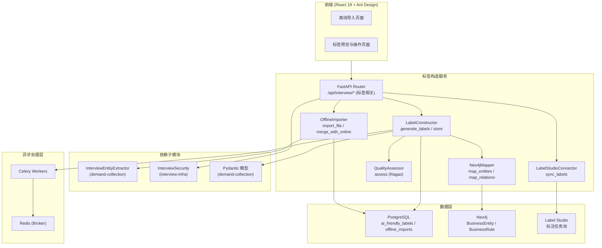
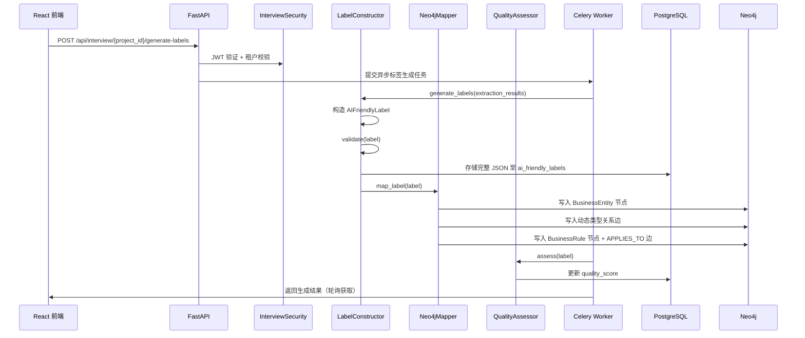
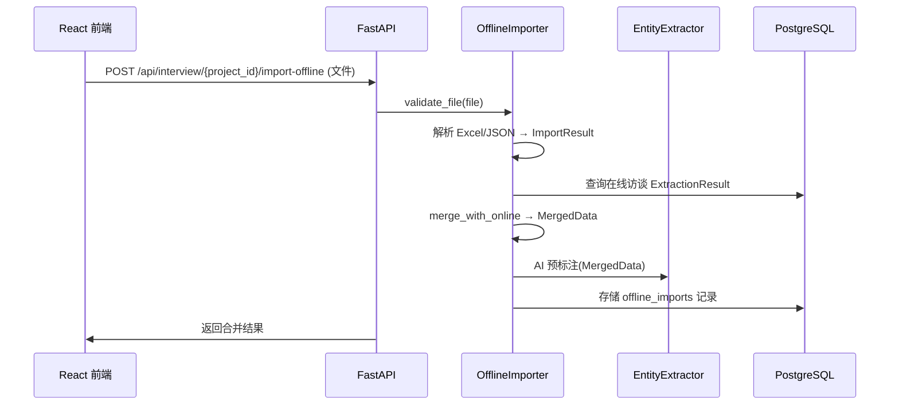
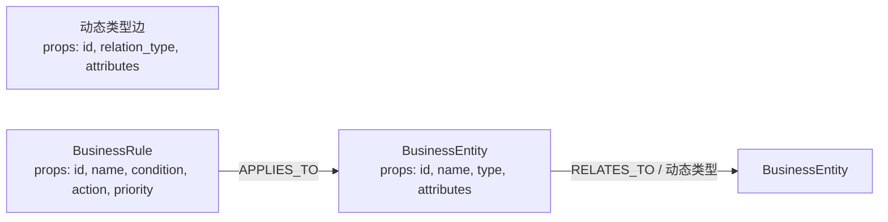

# 设计文档：标签构造子模块（Label Construction）

## 概述

`label-construction` 子模块是 `client-interview` 父模块的数据输出子模块，负责将访谈提取结果转换为标准化 AI_Friendly_Label，实现 PostgreSQL + Neo4j 双重存储，集成 Ragas 质量评估，支持离线数据导入与合并，以及 Label Studio 任务同步。

本子模块提取自父模块 `.kiro/specs/client-interview/`，与 `demand-collection`（数据模型 + 实体提取器）和 `intelligent-interview`（会话提取结果）子模块存在集成关系。

### 设计目标

- 复用 `demand-collection` 子模块的 Pydantic 数据模型和 LabelConstructor.parse/format/validate
- 复用 `interview-infra` 子模块的 InterviewSecurity（JWT + 多租户）
- PostgreSQL 存储完整 JSON，Neo4j 存储实体关系图谱，双重存储保证数据一致性
- Ragas 框架执行标签质量评估
- 离线导入支持 Excel(.xlsx) 和 JSON(.json)，合并后触发 AI 预标注
- Label Studio 同步复用现有 PAT + JWT 认证机制
- 耗时操作通过 Celery 异步处理

### 关键设计决策

| 决策 | 选择 | 理由 |
|------|------|------|
| 双重存储 | PostgreSQL + Neo4j | PostgreSQL 存完整 JSON 便于查询，Neo4j 存图谱便于关系推理 |
| 质量评估 | Ragas 框架 | 复用现有 quality_monitoring/ 模块 |
| 离线文件解析 | openpyxl / json | 成熟的 Python 库，与 demand-collection 文档解析一致 |
| Label Studio 连接 | 复用现有客户端 | PAT + JWT 自动刷新，避免重复建设 |
| 异步处理 | Celery + Redis | 标签生成和质量评估为耗时操作 |

### 依赖子模块

| 子模块 | 依赖组件 | 用途 |
|--------|----------|------|
| `demand-collection` | Pydantic 模型（Entity, Rule, Relation, AIFriendlyLabel, ExtractionResult） | 数据结构复用 |
| `demand-collection` | LabelConstructor.parse / format / validate | 标签解析与格式化 |
| `demand-collection` | InterviewEntityExtractor | 合并后数据的 AI 预标注 |
| `intelligent-interview` | 会话 ExtractionResult | 标签生成的输入数据 |
| `interview-infra` | InterviewSecurity | JWT 认证、多租户隔离 |

## 架构

### 子模块架构图



### 标签生成流程



### 离线导入流程



## 组件与接口

### 1. LabelConstructor（标签构造器 — 生成与存储部分）

职责：将访谈提取结果转换为 AIFriendlyLabel，执行双重存储

```python
# src/interview/label_constructor.py (本子模块扩展 generate_labels 和 store)

class LabelConstructor:
    """标签构造器 — 生成与存储（parse/format/validate 由 demand-collection 提供）"""

    def generate_labels(self, project_id: str, extraction_results: list[ExtractionResult]) -> AIFriendlyLabel:
        """将提取结果转换为标准化 AIFriendlyLabel
        - 聚合多个 ExtractionResult 中的 entities、rules、relations
        - 去重（基于 id 字段）
        - 调用 validate 校验结构合规性
        - 返回 AIFriendlyLabel
        """

    async def store(self, project_id: str, tenant_id: str, label: AIFriendlyLabel) -> None:
        """双重存储
        - PostgreSQL: 写入 ai_friendly_labels 表（label_data JSONB）
        - Neo4j: 调用 Neo4jMapper.map_label 映射实体和关系
        """
```

### 2. Neo4jMapper（Neo4j 映射器）

职责：将实体和关系映射至 Neo4j 知识图谱

```python
# src/interview/neo4j_mapper.py

class Neo4jMapper:
    """将 AIFriendlyLabel 中的实体关系映射至 Neo4j"""

    async def map_entities(self, label: AIFriendlyLabel) -> list[str]:
        """将 entities 映射为 BusinessEntity 节点
        - 每个 Entity → 一个 BusinessEntity 节点
        - 节点属性: id, name, type, attributes (JSON)
        - 返回创建的节点 ID 列表
        """

    async def map_relations(self, label: AIFriendlyLabel) -> list[str]:
        """将 relations 映射为动态类型边
        - 每个 Relation → 一条边，边类型为 relation_type
        - 边属性: id, attributes
        - 返回创建的边 ID 列表
        """

    async def map_rules(self, label: AIFriendlyLabel) -> list[str]:
        """将 rules 映射为 BusinessRule 节点 + APPLIES_TO 边
        - 每个 Rule → 一个 BusinessRule 节点
        - 通过 related_entities 创建 APPLIES_TO 边
        - 返回创建的节点 ID 列表
        """

    async def map_label(self, label: AIFriendlyLabel) -> MappingResult:
        """完整映射：实体 + 关系 + 规则
        - 依次调用 map_entities、map_relations、map_rules
        - 返回 MappingResult（含节点数、边数、错误列表）
        """
```

### 3. QualityAssessor（质量评估器）

职责：复用 Ragas 框架评估标签质量

```python
# src/interview/quality_assessor.py

class QualityAssessor:
    """复用现有 quality_monitoring/ 模块的 Ragas 框架"""

    def __init__(self, ragas_evaluator):
        """注入现有 Ragas 评估器"""

    async def assess(self, label: AIFriendlyLabel, context: dict) -> QualityReport:
        """评估标签质量
        - 调用 Ragas 评估器计算多维度分数
        - 返回 QualityReport（overall_score, dimension_scores, suggestions）
        """
```

### 4. OfflineImporter（离线导入器）

职责：解析 Excel/JSON 离线数据，与在线结果合并

```python
# src/interview/offline_importer.py

class OfflineImporter:
    """导入离线访谈数据并与在线结果合并"""

    def validate_file(self, file_path: str, file_type: str) -> ValidationResult:
        """校验文件格式和内容合法性
        - 检查文件扩展名（.xlsx / .json）
        - 检查文件内容可解析
        - 不合法时返回 ValidationResult（is_valid=False, errors 含行号）
        """

    async def import_file(self, file_path: str, file_type: str) -> ImportResult:
        """解析 Excel(.xlsx) 或 JSON(.json) 文件
        - xlsx: 使用 openpyxl 解析，按列映射为实体/规则/关系
        - json: 使用 json.loads 解析，校验结构
        - 返回标准化 ImportResult
        """

    async def merge_with_online(self, project_id: str, import_result: ImportResult) -> MergedData:
        """将离线数据与在线访谈结果合并
        - 从 PostgreSQL 查询项目的在线 ExtractionResult
        - 合并 entities、rules、relations（基于 id 去重）
        - 返回 MergedData（包含两者所有数据）
        """
```

### 5. LabelStudioConnector（Label Studio 连接器）

职责：将标签数据同步至 Label Studio 任务池

```python
# src/interview/label_studio_connector.py

class LabelStudioConnector:
    """复用现有 Label Studio 客户端，同步标签至任务池"""

    def __init__(self, ls_client):
        """注入现有 Label Studio 客户端（PAT + JWT 自动刷新）"""

    async def sync_labels(self, project_id: str, label: AIFriendlyLabel) -> SyncResult:
        """将标签同步至 Label Studio
        - 将 AIFriendlyLabel 转换为 Label Studio 任务格式
        - 包含 AI 预标注数据（predictions 字段）
        - 调用 Label Studio API 创建任务
        - 返回 SyncResult（task_ids, success_count, error_count）
        """

    async def check_connection(self) -> bool:
        """检查 Label Studio 连接状态
        - 调用 Label Studio health API
        - 连接失败时记录日志并返回 False
        """
```

### API 接口定义

```python
# src/interview/router.py (本子模块涉及的端点)

router = APIRouter(prefix="/api/interview", tags=["interview"])

# 标签生成
POST   /api/interview/{project_id}/generate-labels       # 生成 AI 友好型标签

# 离线导入
POST   /api/interview/{project_id}/import-offline        # 导入离线数据

# Label Studio 同步
POST   /api/interview/{project_id}/sync-to-label-studio  # 同步至 Label Studio
```

### 接口请求/响应详情

#### POST /api/interview/{project_id}/generate-labels

请求：无 body（project_id 从 URL 获取，tenant_id 从 JWT 获取）

响应（异步任务提交后）：
```json
{
  "task_id": "uuid",
  "status": "processing",
  "message": "标签生成任务已提交"
}
```

任务完成后（通过轮询获取）：
```json
{
  "label": {
    "entities": [...],
    "rules": [...],
    "relations": [...]
  },
  "quality_report": {
    "overall_score": 0.85,
    "dimension_scores": {
      "completeness": 0.9,
      "consistency": 0.8,
      "accuracy": 0.85
    },
    "suggestions": ["建议补充实体属性的数据类型约束"]
  },
  "neo4j_mapping": {
    "nodes_created": 12,
    "edges_created": 8,
    "errors": []
  }
}
```

#### POST /api/interview/{project_id}/import-offline

请求：multipart/form-data，file 字段

响应（成功）：
```json
{
  "import_id": "uuid",
  "file_name": "offline_data.xlsx",
  "parsed_entities": 15,
  "parsed_rules": 8,
  "parsed_relations": 6,
  "merged_data": {
    "total_entities": 23,
    "total_rules": 12,
    "total_relations": 10
  },
  "pre_annotation_task_id": "uuid"
}
```

响应（解析失败，422）：
```json
{
  "error": "import_validation_error",
  "message": "离线数据文件解析失败",
  "details": {
    "errors": [
      { "row": 5, "field": "entity_name", "reason": "字段值为空" },
      { "row": 12, "field": "relation_type", "reason": "不支持的关系类型" }
    ]
  },
  "request_id": "uuid"
}
```

#### POST /api/interview/{project_id}/sync-to-label-studio

请求：无 body

响应（成功）：
```json
{
  "sync_result": {
    "task_ids": ["ls_task_001", "ls_task_002"],
    "success_count": 2,
    "error_count": 0,
    "has_predictions": true
  }
}
```

响应（连接失败，502）：
```json
{
  "error": "label_studio_connection_error",
  "message": "无法连接至 Label Studio 服务",
  "details": {
    "host": "label-studio:8080",
    "last_error": "Connection refused"
  },
  "request_id": "uuid"
}
```

## 数据模型

### PostgreSQL 表结构（本子模块管理）

```sql
-- AI 友好型标签表
CREATE TABLE ai_friendly_labels (
    id UUID PRIMARY KEY DEFAULT gen_random_uuid(),
    project_id UUID NOT NULL REFERENCES client_projects(id),
    tenant_id UUID NOT NULL,
    label_data JSONB NOT NULL,  -- { entities: [], rules: [], relations: [] }
    quality_score JSONB,        -- { overall_score, dimension_scores, suggestions }
    version INT DEFAULT 1,
    created_at TIMESTAMPTZ DEFAULT NOW(),
    updated_at TIMESTAMPTZ DEFAULT NOW()
);
CREATE INDEX idx_labels_project ON ai_friendly_labels(project_id);
CREATE INDEX idx_labels_tenant ON ai_friendly_labels(tenant_id);

-- 离线导入记录表
CREATE TABLE offline_imports (
    id UUID PRIMARY KEY DEFAULT gen_random_uuid(),
    project_id UUID NOT NULL REFERENCES client_projects(id),
    tenant_id UUID NOT NULL,
    file_name VARCHAR(255) NOT NULL,
    file_type VARCHAR(10) NOT NULL CHECK (file_type IN ('xlsx', 'json')),
    status VARCHAR(20) DEFAULT 'pending' CHECK (status IN ('pending', 'processing', 'completed', 'failed')),
    error_details JSONB,        -- { errors: [{ row, field, reason }] }
    import_data JSONB,          -- 解析后的标准化数据
    merged_data JSONB,          -- 合并后的数据
    created_at TIMESTAMPTZ DEFAULT NOW()
);
CREATE INDEX idx_imports_project ON offline_imports(project_id);
```

### Neo4j 图模型



映射规则：
- `entities[]` → `BusinessEntity` 节点，`attributes` 序列化为节点属性
- `relations[]` → 动态类型关系边，`relation_type` 作为边类型
- `rules[]` → `BusinessRule` 节点，通过 `related_entities` 创建 `APPLIES_TO` 边

### Pydantic 数据模型（本子模块新增）

```python
from pydantic import BaseModel
from typing import Optional

class MappingResult(BaseModel):
    """Neo4j 映射结果"""
    nodes_created: int = 0
    edges_created: int = 0
    errors: list[str] = []

class QualityReport(BaseModel):
    """质量评估报告"""
    overall_score: float
    dimension_scores: dict  # { completeness, consistency, accuracy, ... }
    suggestions: list[str] = []

class ImportResult(BaseModel):
    """离线文件解析结果"""
    entities: list[dict] = []
    rules: list[dict] = []
    relations: list[dict] = []
    source_file: str
    row_count: int = 0

class MergedData(BaseModel):
    """合并后的数据"""
    entities: list[dict] = []
    rules: list[dict] = []
    relations: list[dict] = []
    online_count: int = 0
    offline_count: int = 0

class ImportValidationError(BaseModel):
    """导入校验错误"""
    row: int
    field: str
    reason: str

class SyncResult(BaseModel):
    """Label Studio 同步结果"""
    task_ids: list[str] = []
    success_count: int = 0
    error_count: int = 0
    has_predictions: bool = False

class ValidationResult(BaseModel):
    """通用校验结果"""
    is_valid: bool
    errors: list[str] = []
```

### 复用的 Pydantic 模型（来自 demand-collection）

- `Entity`, `Rule`, `Relation`, `AIFriendlyLabel` — 标签数据结构
- `ExtractionResult` — 实体提取结果
- `ErrorResponse` — 统一错误响应格式


## Celery 异步任务

```python
# src/interview/tasks.py (本子模块新增任务)

from celery import shared_task

@shared_task(bind=True, max_retries=3, default_retry_delay=5)
def generate_labels_task(self, project_id: str, tenant_id: str):
    """异步标签生成任务
    - 从 PostgreSQL 查询项目的所有 ExtractionResult
    - 调用 LabelConstructor.generate_labels 生成标签
    - 调用 LabelConstructor.store 双重存储
    - 调用 Neo4jMapper.map_label 映射至知识图谱
    - 调用 QualityAssessor.assess 执行质量评估
    - 更新 ai_friendly_labels.quality_score
    - 失败时指数退避重试（最多 3 次）
    """

@shared_task(bind=True, max_retries=3, default_retry_delay=5)
def pre_annotate_merged_task(self, project_id: str, merged_data: dict):
    """异步预标注任务
    - 调用 InterviewEntityExtractor 对合并数据执行 AI 预标注
    - 更新 offline_imports 记录状态
    - 失败时指数退避重试
    """
```

## 正确性属性

### Property 1: 标签生成结构合规

*For any* 项目的访谈提取结果集合，调用 LabelConstructor.generate_labels 生成的 AIFriendlyLabel 应包含 `entities`（数组）、`rules`（数组）和 `relations`（数组）三个顶层字段，且结构通过 JSON Schema 校验。

**验证: 需求 1.1, 1.5**（对应父模块 Property 8）

### Property 2: 标签双重存储

*For any* 生成的 AIFriendlyLabel，系统应同时将完整 JSON 存储至 PostgreSQL `ai_friendly_labels` 表，并将实体和关系映射至 Neo4j 知识图谱（实体映射为 BusinessEntity 节点，关系映射为动态类型边）。

**验证: 需求 1.2, 1.3**（对应父模块 Property 9）

### Property 3: 标签质量评估

*For any* 生成的 AIFriendlyLabel，QualityAssessor 应使用 Ragas 框架执行质量评估并返回包含 overall_score（float）和 dimension_scores（dict）的 QualityReport。

**验证: 需求 1.4**（对应父模块 Property 10）

### Property 4: 离线文件解析

*For any* 合法的 Excel(.xlsx) 或 JSON(.json) 离线数据文件，OfflineImporter.import_file 应成功解析并转换为标准化 ImportResult，包含 entities、rules、relations。

**验证: 需求 2.1**（对应父模块 Property 11）

### Property 5: 离线数据与在线结果合并

*For any* 项目的离线导入数据和在线访谈结果，合并操作应产生包含两者所有数据的 MergedData，且不丢失任何一方的实体、规则或关系。

**验证: 需求 2.2**（对应父模块 Property 12）

### Property 6: 合并数据触发预标注

*For any* 合并完成的数据集，InterviewEntityExtractor 应被调用执行 AI 预标注，并返回 ExtractionResult。

**验证: 需求 2.3**（对应父模块 Property 13）

### Property 7: Label Studio 同步含预标注

*For any* 项目的 AIFriendlyLabel，同步至 Label Studio 后，创建的任务应包含 AI 预标注数据（predictions 字段非空）。

**验证: 需求 3.1, 3.2**（对应父模块 Property 14）

### Property 8: AI_Friendly_Label 往返一致性

*For any* 合法的 AIFriendlyLabel JSON 数据，执行 `parse(format(parse(json)))` 应产生与 `parse(json)` 等价的数据对象。

**验证: 需求 1.5**（对应父模块 Property 21，复用 demand-collection Property 6）

## 错误处理

| 错误类别 | 触发条件 | HTTP 状态码 | 处理方式 |
|----------|----------|-------------|----------|
| 认证失败 | JWT 缺失或过期 | 401 | 返回 `{"error": "unauthorized"}` |
| 权限不足 | 跨租户访问 | 403 | 返回 `{"error": "forbidden"}` |
| 项目不存在 | project_id 无效 | 404 | 返回 `{"error": "not_found"}` |
| 标签校验失败 | AIFriendlyLabel 不符合结构规范 | 422 | 返回具体校验失败字段 |
| 离线数据解析失败 | Excel/JSON 内容不合法 | 422 | 返回失败原因和数据行号 |
| 文件格式不支持 | 上传非 .xlsx/.json 文件 | 400 | 返回支持格式列表 |
| Label Studio 连接失败 | LS 服务不可达 | 502 | 返回错误信息，记录日志 |
| 标签生成超时 | Celery 任务超时 | 504 | 任务自动重试（最多 3 次） |

## 测试策略

### 属性测试（Hypothesis）

| 属性编号 | 属性名称 | 测试文件 | 生成器 |
|----------|----------|----------|--------|
| Property 1 | 标签生成结构合规 | `tests/interview/test_label_properties.py` | 随机 ExtractionResult |
| Property 2 | 标签双重存储 | `tests/interview/test_label_properties.py` | 随机 AIFriendlyLabel |
| Property 3 | 标签质量评估 | `tests/interview/test_label_properties.py` | 随机 AIFriendlyLabel |
| Property 4 | 离线文件解析 | `tests/interview/test_import_properties.py` | 随机 Excel/JSON 内容 |
| Property 5 | 离线数据合并 | `tests/interview/test_import_properties.py` | 随机离线 + 在线数据 |
| Property 6 | 合并数据触发预标注 | `tests/interview/test_import_properties.py` | 随机合并数据 |
| Property 7 | LS 同步含预标注 | `tests/interview/test_sync_properties.py` | 随机 AIFriendlyLabel |
| Property 8 | AI_Friendly_Label 往返一致性 | `tests/interview/test_label_roundtrip.py` | 随机合法 AIFriendlyLabel |

### 属性测试示例

```python
# tests/interview/test_label_properties.py
# Feature: label-construction, Property 1: 标签生成结构合规

from hypothesis import given, settings
from hypothesis import strategies as st

@settings(max_examples=100)
@given(extraction_results=st.lists(extraction_result_strategy(), min_size=1, max_size=5))
def test_generated_label_structure_compliance(extraction_results):
    """
    Feature: label-construction, Property 1: 标签生成结构合规
    For any extraction results, generated label must have entities, rules, relations arrays
    """
    constructor = LabelConstructor()
    label = constructor.generate_labels("project_1", extraction_results)
    assert isinstance(label.entities, list)
    assert isinstance(label.rules, list)
    assert isinstance(label.relations, list)
    # JSON Schema 校验
    json_str = constructor.format(label)
    parsed = json.loads(json_str)
    assert "entities" in parsed
    assert "rules" in parsed
    assert "relations" in parsed
```

```python
# tests/interview/test_import_properties.py
# Feature: label-construction, Property 5: 离线数据与在线结果合并

from hypothesis import given, settings
from hypothesis import strategies as st

@settings(max_examples=100)
@given(
    offline_entities=st.lists(entity_strategy(), min_size=0, max_size=10),
    online_entities=st.lists(entity_strategy(), min_size=0, max_size=10)
)
def test_merge_preserves_all_data(offline_entities, online_entities):
    """
    Feature: label-construction, Property 5: 离线数据与在线结果合并
    Merged data must contain all entities from both sources
    """
    importer = OfflineImporter()
    import_result = ImportResult(entities=offline_entities, rules=[], relations=[], source_file="test.xlsx")
    # mock 在线数据
    online_result = ExtractionResult(entities=online_entities, rules=[], relations=[])
    merged = importer.merge_with_online("project_1", import_result)
    
    offline_ids = {e["id"] for e in offline_entities}
    online_ids = {e.id for e in online_entities}
    merged_ids = {e["id"] for e in merged.entities}
    assert offline_ids.union(online_ids) == merged_ids
```

### 单元测试计划

| 测试范围 | 测试文件 | 关键测试用例 |
|----------|----------|-------------|
| 标签生成 | `tests/interview/test_label.py` | 空提取结果、结构校验失败（需求 1.5） |
| Neo4j 映射 | `tests/interview/test_neo4j_mapper.py` | 实体节点创建、关系边创建、规则节点 + APPLIES_TO |
| 质量评估 | `tests/interview/test_quality.py` | Ragas 评估返回 QualityReport、分数范围校验 |
| 离线导入 | `tests/interview/test_import.py` | 非法格式错误（需求 2.4）、空文件、损坏文件、行号错误 |
| 数据合并 | `tests/interview/test_merge.py` | 空离线 + 有在线、有离线 + 空在线、去重逻辑 |
| LS 同步 | `tests/interview/test_sync.py` | 连接失败处理（需求 3.4）、预标注数据包含 |
| 前端导入 | `tests/interview/test_import_page.tsx` | 文件上传、进度展示、错误详情展示 |
| 前端标签预览 | `tests/interview/test_label_preview.tsx` | JSON 预览、同步按钮、质量报告展示 |
