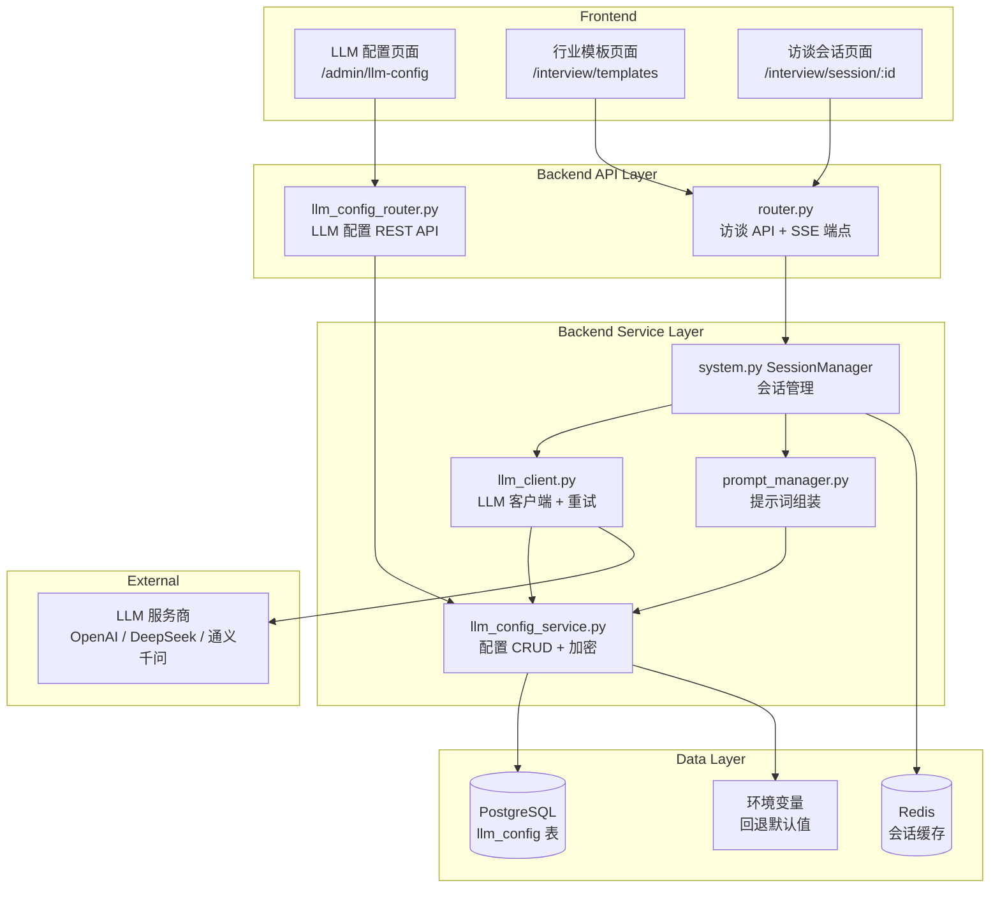

# 设计文档：LLM 配置管理与场景提示词管理

## 概述

本设计为 SuperInsight 访谈系统实现完整的 LLM 集成能力，包括：

1. 后端 LLM 配置管理服务（加密存储、环境变量回退、连通性测试）
2. LLM 客户端服务（httpx 异步调用、OpenAI 兼容 API、流式响应、重试逻辑）
3. 结构化场景提示词管理（四分区编辑、拼接、解析、预览）
4. SessionManager 集成（替换桩响应为真实 LLM 调用）
5. SSE 流式端点
6. 前端管理页面（LLM 配置页 + 增强模板编辑器）

整体架构遵循项目已有的百度网盘配置模式：DB 配置 + 环境变量回退 + 管理员 UI + 连通性测试。

## 架构



### 数据流

1. **配置流**：管理员 → LLM 配置页面 → llm_config_router → llm_config_service → PostgreSQL（加密存储）
2. **调用流**：用户消息 → router → SessionManager → PromptManager（组装 system_prompt）→ LLMClient（加载配置 + 发送请求）→ LLM 服务商
3. **流式流**：用户消息 → SSE 端点 → SessionManager → LLMClient.chat_completion_stream → SSE data 事件 → 前端

## 组件与接口

### 1. llm_config_service.py — LLM 配置管理服务

```python
class LLMConfigService:
    """租户级 LLM 配置 CRUD，API Key 加密存储，环境变量回退。"""

    async def get_config(self, tenant_id: str) -> LLMConfig | None:
        """获取租户 LLM 配置（api_key 返回掩码）。"""

    async def get_config_decrypted(self, tenant_id: str) -> LLMConfig | None:
        """获取租户 LLM 配置（api_key 解密，仅内部使用）。"""

    async def save_config(self, tenant_id: str, req: LLMConfigRequest) -> LLMConfig:
        """UPSERT 保存配置，api_key 加密后存储。"""

    async def get_effective_config(self, tenant_id: str) -> LLMConfig:
        """获取有效配置：优先 DB，回退环境变量。无配置时抛 LLMNotConfiguredError。"""

    async def test_connectivity(self, req: LLMConfigRequest) -> ConnectivityResult:
        """使用提供的配置参数测试 LLM 服务连通性。"""

    def encrypt_api_key(self, api_key: str) -> str:
        """使用 Fernet 对称加密 API Key。"""

    def decrypt_api_key(self, encrypted: str) -> str:
        """解密 API Key。"""

    def mask_api_key(self, api_key: str) -> str:
        """掩码显示：前4位 + **** + 后4位。"""
```

加密方案：使用 `cryptography.fernet.Fernet`，密钥从 `LLM_ENCRYPTION_KEY` 环境变量加载（或从 `JWT_SECRET` 派生）。选择 Fernet 是因为它提供对称加密 + HMAC 验证，适合存储 API Key 这类需要可逆解密的场景。

### 2. llm_client.py — LLM 客户端服务

```python
class LLMServiceError(Exception):
    """LLM 服务调用错误，包含 status_code 和 message。"""
    def __init__(self, status_code: int, message: str): ...

class LLMNotConfiguredError(Exception):
    """LLM 服务未配置。"""
    def __init__(self, message: str = "LLM 服务未配置，请联系管理员"): ...

class LLMClient:
    """OpenAI 兼容 API 客户端，httpx 异步，支持流式和重试。"""

    def __init__(self, config_service: LLMConfigService):
        self._config_service = config_service
        self._http = httpx.AsyncClient(timeout=60)

    async def chat_completion(
        self, tenant_id: str, messages: list[dict], 
        temperature: float | None = None, max_tokens: int | None = None
    ) -> str:
        """发送聊天补全请求，返回完整响应文本。"""

    async def chat_completion_stream(
        self, tenant_id: str, messages: list[dict],
        temperature: float | None = None, max_tokens: int | None = None
    ) -> AsyncGenerator[str, None]:
        """流式聊天补全，逐块 yield 响应文本。"""
```

重试策略：HTTP 429 时读取 `Retry-After` 头，等待后重试，最多 2 次。非 2xx 且非 429 时抛出 `LLMServiceError`。

### 3. prompt_manager.py — 结构化提示词管理

```python
@dataclass
class StructuredPrompt:
    role_definition: str      # 角色定义
    task_description: str     # 任务描述
    behavior_rules: str       # 行为规则
    output_format: str        # 输出格式

class PromptManager:
    """结构化提示词组装、解析、校验。"""

    def assemble(self, prompt: StructuredPrompt) -> str:
        """将四分区拼接为完整 system_prompt。"""

    def parse(self, system_prompt: str) -> StructuredPrompt:
        """将完整 system_prompt 解析回四分区；解析失败时全部填入 role_definition。"""

    def validate_length(self, system_prompt: str) -> bool:
        """校验总长度不超过 8000 字符。"""
```

拼接格式：
```
## 角色定义
{role_definition}

## 任务描述
{task_description}

## 行为规则
{behavior_rules}

## 输出格式
{output_format}
```

### 4. llm_config_router.py — REST API 端点

```
POST /api/llm-config/config          — 保存 LLM 配置（admin）
GET  /api/llm-config/config          — 获取当前配置（api_key 掩码）
POST /api/llm-config/config/test     — 测试连通性（admin）
```

遵循 baidu_pan_router.py 的模式：admin 权限校验、UPSERT 语义、掩码返回。

### 5. SessionManager 增强

在 `system.py` 的 `SessionManager.send_message()` 中：
- 注入 `LLMClient` 和 `PromptManager` 依赖
- 构建消息列表：system（模板 prompt）+ 历史消息 + 当前用户消息
- 调用 `LLMClient.chat_completion()` 获取响应
- 捕获 `LLMNotConfiguredError` → 返回友好提示
- 捕获 `LLMServiceError` → 返回"暂时不可用"+ 记录日志

### 6. SSE 流式端点

```
POST /api/interview/sessions/{session_id}/messages/stream
```

使用 FastAPI 的 `StreamingResponse` + `text/event-stream` content type：
- 每个文本块发送 `data: {chunk}\n\n`
- 完成时发送 `data: [DONE]\n\n`
- 错误时发送 `data: {"error": "AI 响应中断，请重试"}\n\n`
- 完整响应存储到消息历史

### 7. 前端组件

**LLMConfigPage** (`/admin/llm-config`)：
- 表单：服务商下拉、API Key 密码框、Base URL、模型名称、Temperature 滑块、Max Tokens 输入
- 服务商切换自动填充默认 Base URL
- "测试连接"按钮 + "保存配置"按钮
- 仅 admin 可见（ProtectedRoute requireAdmin）

**IndustryTemplatePage 增强**：
- 模板编辑弹窗中替换单一 TextArea 为四分区编辑器
- 折叠面板实时预览拼接后的完整 prompt
- "测试提示词"按钮（调用 LLM 测试）
- 未配置 LLM 时禁用测试按钮

## 数据模型

### llm_config 表（Migration 008）

```sql
CREATE TABLE IF NOT EXISTS llm_config (
    tenant_id VARCHAR(64) PRIMARY KEY,
    provider_name VARCHAR(50) NOT NULL DEFAULT 'openai',
    encrypted_api_key TEXT NOT NULL,
    base_url VARCHAR(512) NOT NULL DEFAULT 'https://api.openai.com/v1',
    model_name VARCHAR(100) NOT NULL DEFAULT 'gpt-3.5-turbo',
    temperature NUMERIC(3,1) NOT NULL DEFAULT 0.7 CHECK (temperature >= 0.0 AND temperature <= 2.0),
    max_tokens INTEGER NOT NULL DEFAULT 2048 CHECK (max_tokens >= 1 AND max_tokens <= 32000),
    created_at TIMESTAMPTZ NOT NULL DEFAULT NOW(),
    updated_at TIMESTAMPTZ NOT NULL DEFAULT NOW()
);
```

设计决策：
- `tenant_id` 为主键，确保每租户一条记录，UPSERT 语义自然实现
- `encrypted_api_key` 使用 TEXT 类型存储 Fernet 加密后的 base64 字符串
- `temperature` 使用 NUMERIC(3,1) 精确存储小数
- CHECK 约束在数据库层面保证参数范围

### Pydantic 模型

```python
class LLMConfigRequest(BaseModel):
    """LLM 配置创建/更新请求。"""
    provider_name: str = Field(..., max_length=50)
    api_key: str = Field(..., min_length=1)
    base_url: str = Field(..., max_length=512)
    model_name: str = Field(..., max_length=100)
    temperature: float = Field(0.7, ge=0.0, le=2.0)
    max_tokens: int = Field(2048, ge=1, le=32000)

class LLMConfigResponse(BaseModel):
    """LLM 配置响应（api_key 掩码）。"""
    configured: bool
    provider_name: str | None = None
    api_key_masked: str | None = None
    base_url: str | None = None
    model_name: str | None = None
    temperature: float | None = None
    max_tokens: int | None = None

class ConnectivityResult(BaseModel):
    """连通性测试结果。"""
    ok: bool
    message: str
    model: str | None = None
    response_time_ms: int | None = None

class StructuredPromptRequest(BaseModel):
    """结构化提示词请求。"""
    role_definition: str = ""
    task_description: str = ""
    behavior_rules: str = ""
    output_format: str = ""

class ChatMessage(BaseModel):
    """LLM 聊天消息。"""
    role: Literal["system", "user", "assistant"]
    content: str
```

### 环境变量（docker-compose 新增）

```yaml
- LLM_API_KEY=${LLM_API_KEY:-}
- LLM_BASE_URL=${LLM_BASE_URL:-https://api.openai.com/v1}
- LLM_MODEL_NAME=${LLM_MODEL_NAME:-gpt-3.5-turbo}
- LLM_TEMPERATURE=${LLM_TEMPERATURE:-0.7}
- LLM_MAX_TOKENS=${LLM_MAX_TOKENS:-2048}
- LLM_ENCRYPTION_KEY=${LLM_ENCRYPTION_KEY:-}
```


## 正确性属性（Correctness Properties）

*属性是指在系统所有有效执行中都应成立的特征或行为——本质上是关于系统应该做什么的形式化陈述。属性是人类可读规格说明与机器可验证正确性保证之间的桥梁。*

### Property 1: 配置保存/读取往返一致性

*For any* 有效的 LLM 配置（provider_name、api_key、base_url、model_name、temperature ∈ [0.0, 2.0]、max_tokens ∈ [1, 32000]）和任意 tenant_id，保存配置后再读取，应返回相同的 provider_name、base_url、model_name、temperature、max_tokens 值。多次保存同一 tenant_id 的配置，数据库中应始终仅保留一条记录，且读取结果为最后一次保存的值。

**Validates: Requirements 1.1, 1.4**

### Property 2: API Key 加密往返与掩码显示

*For any* 非空 api_key 字符串，encrypt_api_key 后再 decrypt_api_key 应返回原始 api_key。同时，对于长度大于 8 的 api_key，mask_api_key 应返回前 4 位 + "****" + 后 4 位的字符串；对于长度 ≤ 8 的 api_key，应返回 "****"。

**Validates: Requirements 1.2**

### Property 3: 环境变量回退

*For any* tenant_id，当数据库中不存在该租户的 LLM 配置时，get_effective_config 应返回从环境变量（LLM_API_KEY、LLM_BASE_URL 等）读取的值。当环境变量也未设置时，应抛出 LLMNotConfiguredError。

**Validates: Requirements 1.3, 6.2, 6.6**

### Property 4: 提示词组装/解析往返一致性

*For any* StructuredPrompt（四个分区均为非空字符串），assemble 后再 parse 应返回与原始相同的四个分区值。对于任意不包含分区标记（"## 角色定义" 等）的字符串，parse 应将完整内容填入 role_definition，其余三个字段为空字符串。

**Validates: Requirements 4.2, 4.3**

### Property 5: 提示词长度校验

*For any* 拼接后的 system_prompt 字符串，validate_length 返回 True 当且仅当字符串长度 ≤ 8000。

**Validates: Requirements 4.5**

### Property 6: 服务商默认 URL 映射

*For any* 已知服务商名称（OpenAI、DeepSeek、通义千问），选择该服务商时应返回对应的默认 Base URL。映射关系为确定性的：相同服务商始终返回相同 URL。

**Validates: Requirements 3.4**

### Property 7: LLM 错误状态码映射

*For any* HTTP 状态码属于非 2xx 且非 429 的范围，LLMClient 应抛出 LLMServiceError 异常，且异常中包含该状态码和错误消息。

**Validates: Requirements 6.5**

### Property 8: 消息列表构建顺序

*For any* system_prompt、历史消息列表（user/assistant 交替）和当前用户消息，构建的消息列表应满足：第一条消息 role 为 "system"，content 为 system_prompt；中间为历史消息（保持原始顺序）；最后一条消息 role 为 "user"，content 为当前用户消息。总长度 = 1 + len(history) + 1。

**Validates: Requirements 7.2**

### Property 9: SSE 事件格式

*For any* 文本块字符串，SSE 格式化后应为 `data: {chunk}\n\n` 格式。对于完成标记，应为 `data: [DONE]\n\n`。

**Validates: Requirements 8.2, 8.3**

## 错误处理

### 后端错误处理策略

| 场景 | 错误类型 | HTTP 状态码 | 用户提示 |
|------|---------|------------|---------|
| LLM 未配置 | `LLMNotConfiguredError` | 200（会话内）/ 400（配置页） | "LLM 服务未配置，请联系管理员" |
| LLM API Key 无效 | `LLMServiceError(401)` | 200（会话内） | "AI 服务暂时不可用，请稍后重试" |
| LLM 速率限制 | HTTP 429 | 自动重试 2 次 | 重试失败后返回 "AI 服务繁忙" |
| LLM 超时 | `httpx.TimeoutException` | 200（会话内） | "AI 响应超时，请重试" |
| 加密密钥缺失 | `ValueError` | 500 | "系统配置错误，请联系管理员" |
| 提示词超长 | 校验失败 | 422 | "提示词总长度不能超过 8000 字符" |
| 非 admin 访问配置 | HTTP 403 | 403 | "仅管理员可操作" |
| SSE 流中断 | 异常 | SSE error 事件 | "AI 响应中断，请重试" |

### 错误处理原则

1. **会话内错误不中断会话**：LLM 调用失败时返回友好提示，HTTP 200，会话保持 active 状态
2. **错误日志**：所有 LLM 调用错误记录 `logging.error`，包含 tenant_id、session_id、错误详情
3. **重试透明**：429 重试对用户透明，仅在重试全部失败后返回错误
4. **加密安全**：API Key 解密失败时不暴露加密细节，仅返回通用错误

## 测试策略

### 属性测试（Property-Based Testing）

使用 **Hypothesis** 库（Python 已有 `.hypothesis` 目录，项目已在使用）。

每个属性测试配置最少 100 次迭代，使用 `@settings(max_examples=100)` 装饰器。

每个测试用注释标注对应的设计属性：
```python
# Feature: llm-config-management, Property 1: 配置保存/读取往返一致性
```

属性测试覆盖：
- Property 1: 生成随机 provider_name、api_key、base_url 等，验证 save→load 往返
- Property 2: 生成随机 api_key 字符串，验证 encrypt→decrypt 往返和 mask 格式
- Property 3: 模拟无 DB 配置场景，设置随机环境变量，验证回退行为
- Property 4: 生成随机四分区字符串，验证 assemble→parse 往返；生成不含分区标记的随机字符串，验证 fallback
- Property 5: 生成随机长度字符串，验证 validate_length 与 len() <= 8000 一致
- Property 6: 从已知服务商列表中随机选择，验证返回的 URL 与预期映射一致
- Property 7: 生成随机非 2xx 非 429 状态码，验证抛出 LLMServiceError
- Property 8: 生成随机 system_prompt、随机长度历史消息列表、随机当前消息，验证构建结果的结构
- Property 9: 生成随机文本块，验证 SSE 格式化结果

### 单元测试

单元测试聚焦于具体示例和边界情况：

- **连通性测试**：mock httpx 响应，验证成功/401/超时三种场景的返回格式（Requirements 2.1-2.4）
- **LLM 客户端重试**：mock 429 响应 + Retry-After 头，验证重试逻辑（Requirement 6.4）
- **SessionManager 错误处理**：mock LLMClient 抛出异常，验证友好提示返回（Requirements 7.4, 7.5）
- **SSE 端点**：验证流式响应的完整生命周期（data 事件 → [DONE]）（Requirements 8.1-8.4）
- **前端组件**：验证 LLM 配置页面表单渲染、服务商切换、admin 权限控制（Requirements 3.1-3.7）
- **提示词测试按钮**：验证未配置 LLM 时禁用状态（Requirement 5.4）

### 测试工具

- 后端：pytest + hypothesis + pytest-asyncio + httpx mock
- 前端：vitest + @testing-library/react
- 属性测试库：hypothesis（Python，已在项目中使用）
- 前端属性测试：fast-check（TypeScript）

