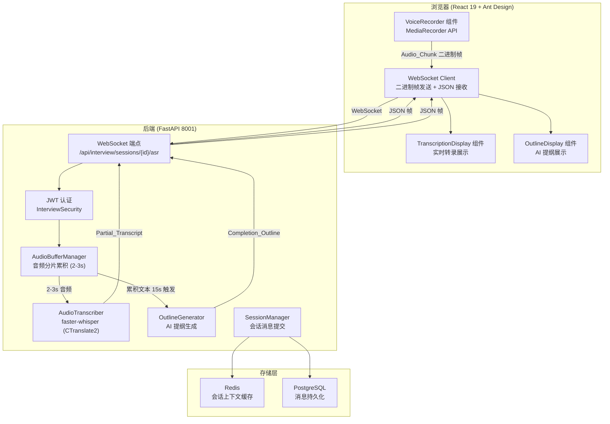
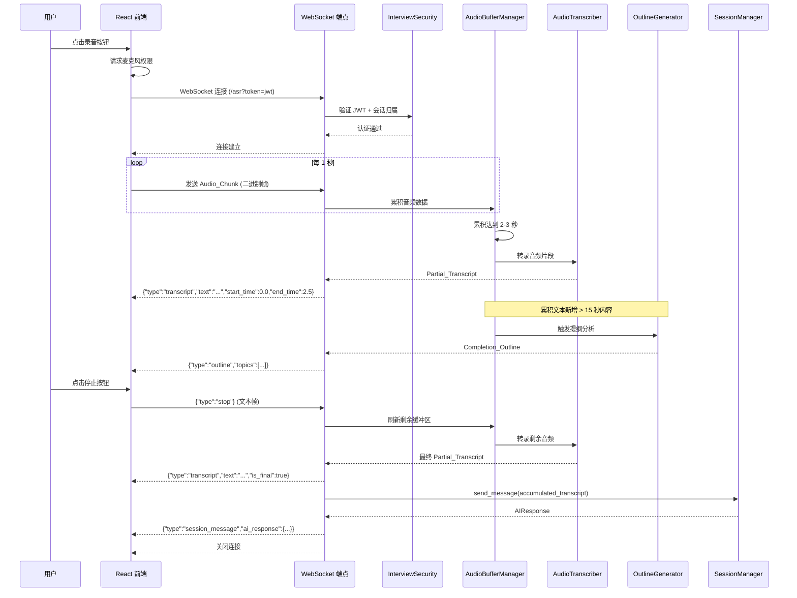

# 设计文档：实时语音输入与ASR流式转录（Realtime Voice ASR）

## 概述

本模块为 SuperInsight 访谈系统新增实时语音流式转录能力。核心流程：浏览器通过 MediaRecorder API 采集 webm/opus 音频，经 WebSocket 二进制帧流式传输至后端；后端在内存中累积音频分片（约 2-3 秒），调用现有 `AudioTranscriber`（faster-whisper, CTranslate2, CPU int8）执行转录，将 Partial_Transcript 以 JSON 帧推送回前端实时展示。累积转录文本每 15 秒触发一次 AI 提纲分析，生成结构化的 Completion_Outline 帮助用户发现遗漏话题。

### 设计目标

- 复用现有 `audio_transcriber.py` 中的 `AudioTranscriber` 实例（`_transcriber`），避免重复加载模型
- 复用 `InterviewSecurity` 的 JWT 认证（WebSocket 握手阶段通过 query param 传递 token）
- 与 `intelligent-interview` 的 `SessionManager` 集成，录音结束后自动提交累积文本为用户消息
- 前端组件嵌入现有 `InterviewSessionPage`，与聊天消息列表视觉区分
- 单个 WebSocket 连接同时承载 ASR 转录结果和 AI 提纲推送，减少连接数

### 关键设计决策

| 决策 | 选择 | 理由 |
|------|------|------|
| 音频传输协议 | WebSocket 二进制帧 | 低延迟双向通信，适合流式音频 + 实时结果推送 |
| 音频格式 | webm/opus | MediaRecorder 默认支持，压缩率高，带宽友好 |
| 音频缓冲策略 | 后端累积 2-3 秒再转录 | faster-whisper 对极短音频识别率低，2-3 秒是精度与延迟的平衡点 |
| 模型复用 | 共享 `router.py` 中的 `_transcriber` 单例 | 避免重复加载 ~300MB 模型，节省内存 |
| JWT 认证方式 | WebSocket 握手 query param `?token=xxx` | WebSocket 不支持自定义 Header，query param 是标准做法 |
| AI 提纲触发 | 每 15 秒新增内容触发 | 避免频繁调用 LLM，平衡实时性与资源消耗 |
| 前端录音库 | 原生 MediaRecorder API | 无需额外依赖，浏览器原生支持 |

### 依赖子模块

| 子模块 | 依赖组件 | 用途 |
|--------|----------|------|
| `interview-infra` | `InterviewSecurity.get_current_tenant()` | WebSocket JWT 认证 |
| `intelligent-interview` | `SessionManager.send_message()` | 录音结束后提交累积文本 |
| 现有 `audio_transcriber.py` | `AudioTranscriber._get_model()`, `_convert_to_wav()` | faster-whisper 模型和音频格式转换 |
| 现有 `router.py` | `_transcriber` 单例, `_session_mgr`, `_security` | 共享实例 |

## 架构

### 系统架构图



### WebSocket 消息流时序图



## 组件与接口

### 1. WebSocket 端点 — ASR 流式转录

```python
# src/interview/asr_router.py

from fastapi import APIRouter, WebSocket, WebSocketDisconnect
from src.interview.asr_handler import ASRWebSocketHandler

asr_router = APIRouter(prefix="/api/interview", tags=["asr"])

@asr_router.websocket("/sessions/{session_id}/asr")
async def asr_websocket(websocket: WebSocket, session_id: str, token: str = ""):
    """WebSocket 端点：实时语音 ASR 转录。
    
    - 握手阶段通过 query param `token` 进行 JWT 认证
    - 接收二进制帧（Audio_Chunk）
    - 接收文本帧（JSON 控制消息：{"type":"stop"}）
    - 推送 JSON 帧（Partial_Transcript / Completion_Outline / 错误消息）
    """
    handler = ASRWebSocketHandler(websocket, session_id, token)
    await handler.handle()
```

### 2. ASRWebSocketHandler — WebSocket 会话处理器

```python
# src/interview/asr_handler.py

class ASRWebSocketHandler:
    """管理单个 WebSocket ASR 会话的完整生命周期。"""

    def __init__(self, websocket: WebSocket, session_id: str, token: str):
        self.websocket = websocket
        self.session_id = session_id
        self.token = token
        self.buffer = AudioBufferManager()
        self.accumulated_text = ""
        self.last_outline_length = 0  # 上次触发提纲时的累积文本长度（秒）
        self.total_audio_seconds = 0.0

    async def handle(self):
        """主循环：认证 → 接收音频 → 转录 → 推送结果。"""

    async def _authenticate(self) -> str:
        """验证 JWT token，返回 tenant_id。失败则关闭连接。"""

    async def _process_audio_chunk(self, data: bytes):
        """将音频分片加入缓冲区，缓冲区满时触发转录。"""

    async def _transcribe_buffer(self) -> str | None:
        """调用 AudioTranscriber 转录缓冲区音频，返回文本。"""

    async def _send_transcript(self, text: str, start_time: float, end_time: float, is_final: bool = False):
        """推送 Partial_Transcript JSON 帧。"""

    async def _maybe_generate_outline(self):
        """检查是否需要触发 AI 提纲生成（每 15 秒新增内容）。"""

    async def _flush_and_close(self):
        """转录剩余缓冲区，提交累积文本至会话，关闭连接。"""
```

### 3. AudioBufferManager — 音频缓冲管理器

```python
# src/interview/audio_buffer.py

class AudioBufferManager:
    """管理音频分片的累积和分段。
    
    累积 Audio_Chunk 直到达到目标时长（2-3 秒），
    然后返回完整的音频数据供转录。
    """

    def __init__(self, target_duration_sec: float = 2.5):
        self.target_duration_sec = target_duration_sec
        self._chunks: list[bytes] = []
        self._total_bytes = 0

    def add_chunk(self, data: bytes) -> None:
        """添加一个音频分片。"""

    def is_ready(self) -> bool:
        """缓冲区是否达到目标时长（基于 opus 码率估算）。"""

    def flush(self) -> bytes | None:
        """取出并清空缓冲区，返回合并的音频数据。如果为空返回 None。"""

    def estimate_duration(self) -> float:
        """基于 opus 平均码率估算当前缓冲区时长（秒）。"""
```

### 4. OutlineGenerator — AI 提纲生成器

```python
# src/interview/outline_generator.py

from pydantic import BaseModel

class OutlineTopic(BaseModel):
    """提纲主题项。"""
    topic_name: str
    description: str

class CompletionOutline(BaseModel):
    """补全提纲。"""
    topics: list[OutlineTopic]

class OutlineGenerator:
    """基于累积转录文本和会话上下文生成访谈补全提纲。"""

    async def generate(
        self, 
        accumulated_transcript: str, 
        session_context: dict
    ) -> CompletionOutline:
        """生成补全提纲。
        
        Args:
            accumulated_transcript: 当前录音会话的累积转录文本
            session_context: 从 Redis 加载的会话上下文（含历史消息、模板等）
        
        Returns:
            CompletionOutline 包含结构化主题列表
        """
```

### 5. 前端组件接口

#### VoiceRecorder 组件

```typescript
// src/frontend/components/VoiceRecorder.tsx

interface VoiceRecorderProps {
  sessionId: string;
  disabled: boolean;  // 会话已结束时禁用
  onTranscript: (transcript: PartialTranscript) => void;
  onOutline: (outline: CompletionOutline) => void;
  onRecordingStart: () => void;
  onRecordingStop: (accumulatedText: string) => void;
  onError: (error: string) => void;
}

interface PartialTranscript {
  text: string;
  start_time: number;
  end_time: number;
  is_final?: boolean;
}

interface OutlineTopic {
  topic_name: string;
  description: string;
}

interface CompletionOutline {
  topics: OutlineTopic[];
}
```

#### TranscriptionPanel 组件

```typescript
// src/frontend/components/TranscriptionPanel.tsx

interface TranscriptionPanelProps {
  transcripts: PartialTranscript[];
  isRecording: boolean;
  outline: CompletionOutline | null;
}
```

### WebSocket 消息协议

#### 客户端 → 服务端

| 类型 | 格式 | 说明 |
|------|------|------|
| 音频数据 | 二进制帧 | MediaRecorder 生成的 webm/opus Audio_Chunk |
| 停止录音 | 文本帧 `{"type":"stop"}` | 通知服务端刷新缓冲区并关闭 |

#### 服务端 → 客户端

| 类型 | 格式 | 说明 |
|------|------|------|
| 转录结果 | `{"type":"transcript","text":"...","start_time":0.0,"end_time":2.5,"is_final":false}` | Partial_Transcript |
| AI 提纲 | `{"type":"outline","topics":[{"topic_name":"...","description":"..."}]}` | Completion_Outline |
| 会话消息 | `{"type":"session_message","ai_response":{...}}` | 录音结束后的 AI 响应 |
| 错误 | `{"type":"error","error_code":"...","error_message":"..."}` | 错误通知，不中断连接 |


## 数据模型

### Pydantic 模型（后端新增）

```python
# src/interview/asr_models.py

from pydantic import BaseModel, Field
from typing import Optional
from datetime import datetime

class PartialTranscript(BaseModel):
    """部分转录结果 — 单个音频片段的转录输出。"""
    text: str
    start_time: float
    end_time: float
    is_final: bool = False

class OutlineTopic(BaseModel):
    """提纲主题项。"""
    topic_name: str
    description: str

class CompletionOutline(BaseModel):
    """补全提纲 — AI 生成的结构化访谈补充建议。"""
    topics: list[OutlineTopic]

class ASRWebSocketMessage(BaseModel):
    """WebSocket 服务端推送消息的统一格式。"""
    type: str  # "transcript" | "outline" | "session_message" | "error"
    text: Optional[str] = None
    start_time: Optional[float] = None
    end_time: Optional[float] = None
    is_final: Optional[bool] = None
    topics: Optional[list[OutlineTopic]] = None
    ai_response: Optional[dict] = None
    error_code: Optional[str] = None
    error_message: Optional[str] = None

class ASRControlMessage(BaseModel):
    """WebSocket 客户端发送的控制消息。"""
    type: str  # "stop"
```

### TypeScript 类型（前端新增）

```typescript
// src/frontend/types/asr.ts

export interface PartialTranscript {
  text: string;
  start_time: number;
  end_time: number;
  is_final?: boolean;
}

export interface OutlineTopic {
  topic_name: string;
  description: string;
}

export interface CompletionOutline {
  topics: OutlineTopic[];
}

export interface ASRWebSocketMessage {
  type: 'transcript' | 'outline' | 'session_message' | 'error';
  text?: string;
  start_time?: number;
  end_time?: number;
  is_final?: boolean;
  topics?: OutlineTopic[];
  ai_response?: {
    message: string;
    implicit_gaps: Array<{ gap_description: string; suggested_question: string }>;
    current_round: number;
    max_rounds: number;
  };
  error_code?: string;
  error_message?: string;
}
```

### Redis 缓存结构（新增）

```
# ASR 会话累积转录文本（TTL: 与录音会话同生命周期）
interview:session:{session_id}:asr:transcript -> string (累积转录文本)

# ASR 会话音频时长统计
interview:session:{session_id}:asr:audio_seconds -> float (已转录音频总秒数)
```

### interview_messages 表扩展

现有 `interview_messages` 表的 `role` 字段已支持 `'user'`，语音输入的消息通过在消息 metadata 中添加 `source: 'voice'` 标记来区分：

```sql
-- 无需新增表，复用现有 interview_messages
-- 语音消息通过 extraction_result JSONB 字段中的 metadata 标记
-- 示例: extraction_result = {"source": "voice", "audio_duration_seconds": 120.5}
```


## 正确性属性

*正确性属性是在系统所有有效执行中都应成立的特征或行为——本质上是关于系统应该做什么的形式化陈述。属性是人类可读规范与机器可验证正确性保证之间的桥梁。*

### Property 1: WebSocket URL 包含 JWT Token

*For any* JWT token 字符串，构建 ASR WebSocket 连接 URL 时，该 URL 的 query parameter 中必须包含 `token` 参数且值等于原始 token。

**验证: 需求 2.2**

### Property 2: 音频分片以二进制帧发送

*For any* MediaRecorder 生成的 Audio_Chunk（任意非空字节序列），Audio_Streamer 应通过 WebSocket 以二进制帧（非文本帧）发送该数据，且发送的数据与原始 Audio_Chunk 字节完全一致。

**验证: 需求 2.3**

### Property 3: WebSocket 重连次数上限

*For any* WebSocket 断开事件序列，Audio_Streamer 的重连尝试次数不应超过 3 次。当重连计数达到 3 时，录音状态应变为停止。

**验证: 需求 2.4**

### Property 4: JWT 认证拒绝无效 Token

*For any* WebSocket 连接请求，若 JWT token 无效（过期、签名错误、缺少 tenant_id）或 session_id 不属于该 tenant，ASR_Engine 应拒绝连接并关闭 WebSocket。

**验证: 需求 3.2**

### Property 5: 音频缓冲区累积与刷新

*For any* 音频分片序列，AudioBufferManager 应在累积数据估算时长达到目标阈值（2-3 秒）时返回 `is_ready() == True`；调用 `flush()` 后缓冲区应为空且返回的数据是所有已添加分片的拼接。当收到停止信号时，`flush()` 应返回所有剩余数据（即使不足阈值）。

**验证: 需求 3.3, 3.7**

### Property 6: 转录结果 JSON 格式完整性

*For any* 转录结果推送，JSON 消息必须包含 `type="transcript"`、非空 `text` 字段、`start_time`（≥ 0）和 `end_time`（> start_time）字段。

**验证: 需求 3.4**

### Property 7: 转录错误不中断连接

*For any* 转录过程中发生的错误，ASR_Engine 推送的错误消息必须包含 `type="error"`、非空 `error_code` 和 `error_message` 字段，且 WebSocket 连接保持打开状态。

**验证: 需求 3.6**

### Property 8: 转录文本按序追加

*For any* Partial_Transcript 序列 [T1, T2, ..., Tn]，前端 Transcription_Display 中展示的文本顺序应与接收顺序一致，且累积文本等于所有 Partial_Transcript.text 的有序拼接。

**验证: 需求 4.1**

### Property 9: 录音结束提交累积文本

*For any* 非空的 Accumulated_Transcript，当用户停止录音时，该文本应作为一条用户消息提交至 Interview_Session（通过 SessionManager.send_message），且消息 metadata 中包含 `source: "voice"` 标记。

**验证: 需求 4.4, 6.1, 6.4**

### Property 10: AI 提纲触发条件

*For any* 录音会话中的累积转录文本，Outline_Generator 仅在以下条件同时满足时触发分析：(1) 累积音频总时长 ≥ 30 秒；(2) 自上次触发以来新增转录内容对应的音频时长 ≥ 15 秒。

**验证: 需求 5.1, 5.6**

### Property 11: 提纲结构完整性

*For any* 生成的 Completion_Outline，其 `topics` 列表中的每个元素必须包含非空的 `topic_name` 和 `description` 字段。

**验证: 需求 5.3**

### Property 12: 新提纲替换旧提纲

*For any* 连续生成的两个 Completion_Outline（O1, O2），前端展示的提纲应始终为最新的 O2，O1 不再展示。

**验证: 需求 5.4**

### Property 13: 录音期间禁用文字输入

*For any* 录音状态为"正在录音"的时刻，InterviewSessionPage 的文字输入框应处于 disabled 状态。

**验证: 需求 6.2**

## 错误处理

| 错误场景 | 触发条件 | 处理方式 |
|----------|----------|----------|
| 麦克风权限拒绝 | 用户拒绝 `getUserMedia` 权限请求 | 前端展示"请允许麦克风权限以使用语音输入"提示，保持文字输入可用 |
| 浏览器不支持 MediaRecorder | `typeof MediaRecorder === 'undefined'` | 前端隐藏录音按钮，展示"当前浏览器不支持语音录入"提示 |
| WebSocket 连接失败 | 网络异常或服务端不可达 | 自动重连（最多 3 次，间隔 3 秒），全部失败后停止录音并提示 |
| JWT 认证失败 | token 过期或无效 | WebSocket 握手阶段返回 4008 关闭码，前端提示"认证已过期，请刷新页面" |
| 会话不存在 | session_id 无效 | WebSocket 握手阶段返回 4004 关闭码，前端提示"会话不存在" |
| 会话已结束 | session status 为 completed/terminated | WebSocket 握手阶段返回 4009 关闭码，前端禁用录音按钮 |
| 转录失败 | faster-whisper 处理异常 | 推送 `{"type":"error","error_code":"transcription_failed","error_message":"..."}` 错误帧，跳过当前缓冲区，继续接收后续音频 |
| 音频格式异常 | 收到非 webm/opus 数据 | 推送错误帧，丢弃异常数据，继续接收 |
| AI 提纲生成失败 | LLM 调用超时或异常 | 静默跳过本次提纲生成，等待下次触发，不影响转录流程 |
| 录音超时 | 录音超过 30 分钟 | 前端自动触发停止录音，提交已累积文本 |

### WebSocket 关闭码定义

| 关闭码 | 含义 | 说明 |
|--------|------|------|
| 1000 | 正常关闭 | 录音正常结束 |
| 4004 | 会话不存在 | session_id 无效 |
| 4008 | 认证失败 | JWT token 无效或过期 |
| 4009 | 会话已结束 | 会话状态为 completed/terminated |

## 测试策略

### 属性测试（Property-Based Testing）

后端使用 **Hypothesis**（Python），前端使用 **fast-check**（已在 package.json devDependencies 中）。每个属性测试至少运行 100 次迭代。每个正确性属性由一个属性测试实现，测试注释中标注对应的属性编号。

| 属性编号 | 属性名称 | 测试文件 | 框架 | 生成器 |
|----------|----------|----------|------|--------|
| Property 1 | WebSocket URL 包含 JWT Token | `src/frontend/__tests__/asr-websocket.test.ts` | fast-check | 随机 JWT 字符串 |
| Property 2 | 音频分片以二进制帧发送 | `src/frontend/__tests__/asr-websocket.test.ts` | fast-check | 随机 Uint8Array |
| Property 3 | WebSocket 重连次数上限 | `src/frontend/__tests__/asr-websocket.test.ts` | fast-check | 随机断开事件序列 |
| Property 4 | JWT 认证拒绝无效 Token | `tests/interview/test_asr_properties.py` | Hypothesis | 随机字符串 token |
| Property 5 | 音频缓冲区累积与刷新 | `tests/interview/test_asr_properties.py` | Hypothesis | 随机字节序列列表 |
| Property 6 | 转录结果 JSON 格式完整性 | `tests/interview/test_asr_properties.py` | Hypothesis | 随机 PartialTranscript |
| Property 7 | 转录错误不中断连接 | `tests/interview/test_asr_properties.py` | Hypothesis | 随机异常类型 |
| Property 8 | 转录文本按序追加 | `src/frontend/__tests__/asr-display.test.ts` | fast-check | 随机 PartialTranscript 序列 |
| Property 9 | 录音结束提交累积文本 | `tests/interview/test_asr_properties.py` | Hypothesis | 随机文本序列 |
| Property 10 | AI 提纲触发条件 | `tests/interview/test_asr_properties.py` | Hypothesis | 随机 (总时长, 新增时长) 对 |
| Property 11 | 提纲结构完整性 | `tests/interview/test_asr_properties.py` | Hypothesis | 随机 OutlineTopic 列表 |
| Property 12 | 新提纲替换旧提纲 | `src/frontend/__tests__/asr-display.test.ts` | fast-check | 随机 CompletionOutline 序列 |
| Property 13 | 录音期间禁用文字输入 | `src/frontend/__tests__/asr-display.test.ts` | fast-check | 随机 isRecording 布尔值 |

### 属性测试标注格式

```python
# Feature: realtime-voice-asr, Property 5: 音频缓冲区累积与刷新
```

```typescript
// Feature: realtime-voice-asr, Property 1: WebSocket URL 包含 JWT Token
```

### 单元测试计划

| 测试范围 | 测试文件 | 关键测试用例 |
|----------|----------|-------------|
| AudioBufferManager | `tests/interview/test_audio_buffer.py` | 空缓冲区 flush 返回 None、单个分片不触发 ready、多分片累积触发 ready |
| ASR WebSocket 认证 | `tests/interview/test_asr_auth.py` | 有效 token 通过、过期 token 拒绝、缺少 tenant_id 拒绝、session 不属于 tenant 拒绝 |
| OutlineGenerator 触发逻辑 | `tests/interview/test_outline_trigger.py` | 不足 30 秒不触发、满 30 秒且新增 15 秒触发、连续触发间隔检查 |
| 前端 VoiceRecorder | `src/frontend/__tests__/voice-recorder.test.ts` | 开始录音、停止录音、麦克风权限拒绝处理、浏览器不支持处理 |
| 前端 TranscriptionPanel | `src/frontend/__tests__/transcription-panel.test.ts` | 转录文本追加、提纲展示与替换、录音结束后文本提交 |
| WebSocket 重连 | `src/frontend/__tests__/asr-reconnect.test.ts` | 断开后自动重连、3 次失败后停止、重连成功后重置计数 |
