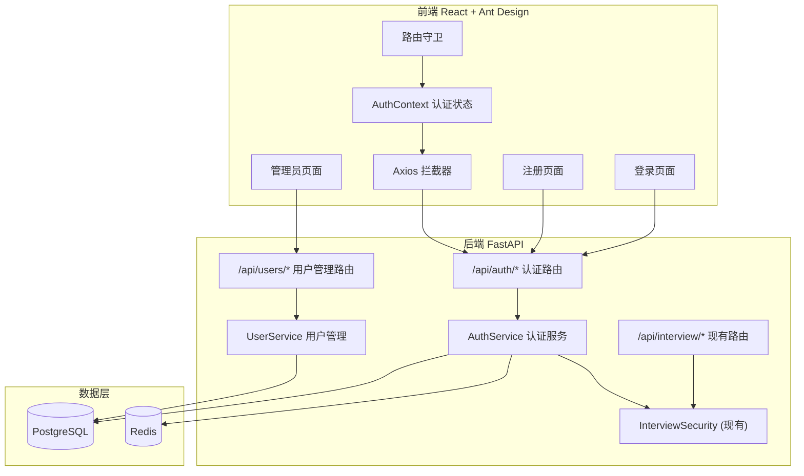

# 技术设计文档：用户认证与企业管理系统

## 概述

本设计为 SuperInsight Interview Service 添加完整的用户认证与企业管理能力。系统基于现有技术栈（FastAPI + SQLAlchemy async + PostgreSQL + Redis）构建，复用现有 JWT 机制（`src/interview/security.py` 中的 `InterviewSecurity`），新增用户注册/登录、令牌刷新、企业管理、管理员用户管理（含批量导入）等后端 API，以及登录/注册/管理员页面等前端组件。

核心设计决策：
- 复用现有 `JWT_SECRET` / `JWT_ALGORITHM` 配置，确保新签发的 JWT 与 `InterviewSecurity.get_current_tenant` 完全兼容
- 在 JWT payload 中新增 `user_id` 和 `role` 声明，同时保留 `tenant_id`
- 使用 Redis 存储 Refresh Token 黑名单，实现单次使用策略
- 密码使用 bcrypt 哈希存储
- 前端使用 React Context 管理认证状态，Axios 拦截器自动刷新令牌

## 架构



### 与现有系统的集成方式

1. `AuthService` 使用 `settings.JWT_SECRET` 和 `settings.JWT_ALGORITHM` 签发令牌
2. 签发的 JWT 包含 `tenant_id` 声明，与现有 `get_current_tenant` 依赖完全兼容
3. 新增的 `get_current_user` 依赖从 JWT 中提取完整用户信息（user_id, tenant_id, role）
4. 现有 `/api/interview/*` 路由无需任何修改

## 组件与接口

### 后端组件

#### 1. AuthService (`src/interview/auth_service.py`)

负责用户注册、登录、令牌签发与刷新。

```python
class AuthService:
    async def register(self, email: str, password: str, enterprise_code: str) -> TokenPair
    async def login(self, email: str, password: str) -> TokenPair
    async def refresh_token(self, refresh_token: str) -> TokenPair
    def create_access_token(self, user_id: str, tenant_id: str, role: str) -> str
    def create_refresh_token(self, user_id: str) -> str
    async def revoke_refresh_token(self, token: str) -> None
```

#### 2. UserService (`src/interview/user_service.py`)

负责管理员对企业用户的 CRUD 和批量导入。

```python
class UserService:
    async def list_users(self, tenant_id: str, page: int, size: int, search: str | None) -> PaginatedUsers
    async def create_user(self, tenant_id: str, data: UserCreateRequest) -> UserResponse
    async def update_user(self, tenant_id: str, user_id: str, data: UserUpdateRequest) -> UserResponse
    async def delete_user(self, tenant_id: str, user_id: str) -> None
    async def batch_import(self, tenant_id: str, file_content: bytes, file_type: str) -> BatchImportResult
```

#### 3. EnterpriseService (`src/interview/enterprise_service.py`)

负责企业的创建与管理。

```python
class EnterpriseService:
    async def create_enterprise(self, name: str, domain: str) -> EnterpriseResponse
    async def get_enterprise_by_code(self, code: str) -> Enterprise | None
    async def disable_enterprise(self, enterprise_id: str) -> None
```

### 后端 API 接口

#### 认证路由 (`/api/auth`)

| 方法 | 路径 | 描述 | 认证 |
|------|------|------|------|
| POST | `/api/auth/register` | 用户注册 | 无 |
| POST | `/api/auth/login` | 用户登录 | 无 |
| POST | `/api/auth/refresh` | 刷新令牌 | 无（需 Refresh Token） |

#### 用户管理路由 (`/api/users`)

| 方法 | 路径 | 描述 | 认证 |
|------|------|------|------|
| GET | `/api/users` | 查询用户列表（分页） | Admin |
| POST | `/api/users` | 创建用户 | Admin |
| PUT | `/api/users/{user_id}` | 修改用户 | Admin |
| DELETE | `/api/users/{user_id}` | 删除用户（软删除） | Admin |
| POST | `/api/users/batch-import` | 批量导入用户 | Admin |

#### 请求/响应模型

```python
# 注册请求
class RegisterRequest(BaseModel):
    email: str  # 企业邮箱
    password: str  # 密码，最少 8 位
    enterprise_code: str  # 企业号

# 登录请求
class LoginRequest(BaseModel):
    email: str
    password: str

# 令牌响应
class TokenResponse(BaseModel):
    access_token: str
    refresh_token: str
    token_type: str = "bearer"
    expires_in: int  # 秒

# 刷新请求
class RefreshRequest(BaseModel):
    refresh_token: str

# 用户创建请求（管理员）
class UserCreateRequest(BaseModel):
    email: str
    password: str
    role: str = "member"  # "admin" | "member"

# 用户更新请求（管理员）
class UserUpdateRequest(BaseModel):
    role: str | None = None
    is_active: bool | None = None

# 用户响应
class UserResponse(BaseModel):
    id: str
    email: str
    role: str
    is_active: bool
    created_at: datetime

# 分页用户列表
class PaginatedUsers(BaseModel):
    items: list[UserResponse]
    total: int
    page: int
    size: int

# 批量导入结果
class BatchImportResult(BaseModel):
    success_count: int
    failure_count: int
    errors: list[BatchImportError]

class BatchImportError(BaseModel):
    row: int
    reason: str
```

### 前端组件

#### 1. AuthContext (`src/frontend/contexts/AuthContext.tsx`)

全局认证状态管理，提供 `login`、`register`、`logout` 方法，管理 JWT 存储与自动刷新。

#### 2. LoginPage (`src/frontend/pages/LoginPage.tsx`)

登录表单页面，包含企业邮箱和密码输入框，登录成功后跳转到 `/interview/start`。

#### 3. RegisterPage (`src/frontend/pages/RegisterPage.tsx`)

注册表单页面，包含企业邮箱、密码、企业号输入框，注册成功后自动登录并跳转。

#### 4. AdminUserPage (`src/frontend/pages/AdminUserPage.tsx`)

管理员用户管理页面，包含用户列表表格（分页、搜索）、新增/编辑用户弹窗、批量导入功能。

#### 5. ProtectedRoute (`src/frontend/components/ProtectedRoute.tsx`)

路由守卫组件，检查认证状态和角色权限，未认证重定向到 `/login`。


## 数据模型

### 数据库迁移 (`migrations/004_create_auth_tables.sql`)

```sql
BEGIN;

-- 企业表
CREATE TABLE IF NOT EXISTS enterprises (
    id UUID PRIMARY KEY DEFAULT gen_random_uuid(),
    name VARCHAR(255) NOT NULL,
    code VARCHAR(50) NOT NULL UNIQUE,  -- 企业号
    domain VARCHAR(255),               -- 企业邮箱域名
    status VARCHAR(20) DEFAULT 'active' CHECK (status IN ('active', 'disabled')),
    created_at TIMESTAMPTZ DEFAULT NOW(),
    updated_at TIMESTAMPTZ DEFAULT NOW()
);

CREATE UNIQUE INDEX IF NOT EXISTS idx_enterprises_code ON enterprises(code);
CREATE INDEX IF NOT EXISTS idx_enterprises_domain ON enterprises(domain);

-- 用户表
CREATE TABLE IF NOT EXISTS users (
    id UUID PRIMARY KEY DEFAULT gen_random_uuid(),
    email VARCHAR(255) NOT NULL UNIQUE,
    password_hash VARCHAR(255) NOT NULL,
    enterprise_id UUID NOT NULL REFERENCES enterprises(id),
    role VARCHAR(20) DEFAULT 'member' CHECK (role IN ('admin', 'member')),
    is_active BOOLEAN DEFAULT true,
    is_deleted BOOLEAN DEFAULT false,  -- 软删除标记
    created_at TIMESTAMPTZ DEFAULT NOW(),
    updated_at TIMESTAMPTZ DEFAULT NOW()
);

CREATE UNIQUE INDEX IF NOT EXISTS idx_users_email ON users(email) WHERE is_deleted = false;
CREATE INDEX IF NOT EXISTS idx_users_enterprise ON users(enterprise_id);

-- 刷新令牌表
CREATE TABLE IF NOT EXISTS refresh_tokens (
    id UUID PRIMARY KEY DEFAULT gen_random_uuid(),
    user_id UUID NOT NULL REFERENCES users(id),
    token_hash VARCHAR(255) NOT NULL UNIQUE,  -- 存储 token 的哈希值
    is_used BOOLEAN DEFAULT false,
    expires_at TIMESTAMPTZ NOT NULL,
    created_at TIMESTAMPTZ DEFAULT NOW()
);

CREATE INDEX IF NOT EXISTS idx_refresh_tokens_user ON refresh_tokens(user_id);
CREATE INDEX IF NOT EXISTS idx_refresh_tokens_hash ON refresh_tokens(token_hash);

COMMIT;
```

### 关键设计说明

1. `enterprises.code` 即为需求中的 Enterprise_Code，使用 UNIQUE 约束保证唯一性
2. `users.enterprise_id` 关联企业表，在 JWT 中作为 `tenant_id` 使用（`tenant_id = enterprise_id`）
3. `users` 表使用条件唯一索引 `WHERE is_deleted = false`，允许软删除后邮箱被重新注册
4. `refresh_tokens` 表存储 token 的哈希值而非明文，`is_used` 字段实现单次使用策略
5. 过期的 refresh_tokens 可通过定时任务清理

### Pydantic 模型 (`src/interview/auth_models.py`)

```python
from pydantic import BaseModel, Field, field_validator
from datetime import datetime
import re

PUBLIC_EMAIL_DOMAINS = {"gmail.com", "qq.com", "163.com", "126.com", "hotmail.com", "outlook.com", "yahoo.com"}

class RegisterRequest(BaseModel):
    email: str = Field(..., description="企业邮箱")
    password: str = Field(..., min_length=8, description="密码")
    enterprise_code: str = Field(..., min_length=1, description="企业号")

    @field_validator("email")
    @classmethod
    def validate_enterprise_email(cls, v: str) -> str:
        pattern = r'^[a-zA-Z0-9._%+-]+@[a-zA-Z0-9.-]+\.[a-zA-Z]{2,}$'
        if not re.match(pattern, v):
            raise ValueError("邮箱格式无效")
        domain = v.split("@")[1].lower()
        if domain in PUBLIC_EMAIL_DOMAINS:
            raise ValueError("请使用企业邮箱注册")
        return v.lower()

class LoginRequest(BaseModel):
    email: str = Field(..., description="企业邮箱")
    password: str = Field(..., min_length=1, description="密码")

class RefreshRequest(BaseModel):
    refresh_token: str

class TokenResponse(BaseModel):
    access_token: str
    refresh_token: str
    token_type: str = "bearer"
    expires_in: int

class UserCreateRequest(BaseModel):
    email: str
    password: str = Field(..., min_length=8)
    role: str = Field(default="member", pattern=r"^(admin|member)$")

class UserUpdateRequest(BaseModel):
    role: str | None = Field(default=None, pattern=r"^(admin|member)$")
    is_active: bool | None = None

class UserResponse(BaseModel):
    id: str
    email: str
    role: str
    is_active: bool
    created_at: datetime

class PaginatedUsers(BaseModel):
    items: list[UserResponse]
    total: int
    page: int
    size: int

class BatchImportError(BaseModel):
    row: int
    reason: str

class BatchImportResult(BaseModel):
    success_count: int
    failure_count: int
    errors: list[BatchImportError]
```

### JWT Payload 结构

```json
{
  "user_id": "uuid-string",
  "tenant_id": "enterprise-uuid",
  "role": "admin|member",
  "exp": 1700000000,
  "iat": 1699998200
}
```

- `tenant_id` 等于 `enterprise_id`，确保与现有 `InterviewSecurity.get_current_tenant` 兼容
- Access Token 有效期 30 分钟，Refresh Token 有效期 7 天

### 配置扩展 (`src/interview/config.py`)

在现有 `Settings` 类中新增：

```python
ACCESS_TOKEN_EXPIRE_MINUTES: int = int(os.getenv("ACCESS_TOKEN_EXPIRE_MINUTES", "30"))
REFRESH_TOKEN_EXPIRE_DAYS: int = int(os.getenv("REFRESH_TOKEN_EXPIRE_DAYS", "7"))
REDIS_URL: str = os.getenv("REDIS_URL", "redis://localhost:6379/0")
```

